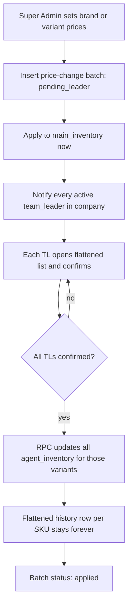

# Company Price Update — Super Admin Set, Agent Cascade, TL Agreement, Flattened History

**Status:** plan only. Do not implement until this file is picked up as a build ticket.

**Related:** [super-admin-workflow.md](./super-admin-workflow.md), [team-leader-workflow.md](./team-leader-workflow.md), System Settings (`/system-settings`)

Scope is **one tenant** (`profiles.company_id` / `companies.id`). Super Admin sets selling / DSP / RSP for a brand or variant. After Team Leaders **review and confirm**, every agent bag under that company gets the same prices.

This is **not** System Administrator (platform) pricing. This is **not** Key Account rebate replacement pricing.

---

## Warehouse link required (hard gate)

This whole feature — batch create, TL agreement, agent cascade, flattened history — is **only for Standard Account companies linked to a warehouse hub**.

Same check as client returns and hub POs:

- UI: `usePermissions().hasWarehouseHubLink` (`get_linked_warehouse_company_id()`)
- DB: `warehouse_company_assignments` has a row for this sales `company_id`

| Company | What they get |
|---|---|
| **Linked to warehouse** | Batch price update + TL confirm + cascade to all agent bags + flattened history |
| **Not linked** | **No new UI, no RPCs, no history.** Keep today’s Main Inventory single/bulk price edit on `main_inventory` only. Do not cascade to agents. |
| **Warehouse role / hub company** | Out of scope. Hub does not set tenant bag prices. |

RPCs must refuse if `get_linked_warehouse_company_id()` is null (`success: false`, error like `Only warehouse-linked companies can push company prices`). Hide sidebar items and Main Inventory batch dialog while `hasWarehouseHubLink` is false (and while that query is loading).

Catalog for linked tenants is warehouse-owned (`/brands` may be hidden). Selling / DSP / RSP still live on **tenant** `main_inventory` — that is what this flow updates, not warehouse hub cost.

---

## Why this exists

Today Super Admin can already bulk-edit prices on **Main Inventory only**:

- UI: `MainInventoryPage.tsx` → bulk price dialog (flavors or batteries of one brand)
- Write path: `inventoryService.updateVariant()` → `main_inventory.selling_price / dsp_price / rsp_price`
- `unit_price` (cost) is left alone

What does **not** happen:

- `agent_inventory` rows keep the prices copied at **allocation time** (`allocated_price` ← main `selling_price`, plus `dsp_price` / `rsp_price`). See `allocate_to_leader` / stock-request approve RPCs.
- There is no readable history of “RELX Menthol selling ₱120 → ₱150”.
- Team Leaders are not asked to confirm, so field bags can stay on old prices while main is new (or, if we cascade blindly, bags change with no TL sign-off).

Orders already **snapshot** `client_order_items.unit_price` at submit. Historical ORDs must not change when prices update.

---

## Locked product rules

1. Company **must** be warehouse-linked. If not, stop — do not create a batch.
2. Super Admin (and Admin if we keep current Main Inventory access) creates a **price change batch** for the company.
3. Scope is always `company_id`. Every `agent_inventory` row for those `variant_id`s under that company is in play — leaders and mobile sales.
4. Columns that move:

   | Location | Columns |
   |---|---|
   | `main_inventory` | `selling_price`, `dsp_price`, `rsp_price` |
   | `agent_inventory` | `allocated_price` (selling), `dsp_price`, `rsp_price` |

   Do **not** bulk-overwrite `main_inventory.unit_price` (cost).
5. Team Leaders must **review and confirm** the batch before agent bags update.
6. History is **flat one row per SKU**, not nested JSON from `system_audit_log`.

---

## Recommended workflow (locked)

Main inventory can go live immediately so **new allocations** already use the new price. Agent bags wait for TL agreement so field selling price does not silently move.



### Edge cases

| Case | Behavior |
|---|---|
| Company has **zero** team leaders | Auto-confirm. Apply agent cascade in the same RPC as main. |
| New TL created after batch is pending | Include them; they must confirm too. |
| TL deactivated / resigned while pending | Drop from required set; remaining active TLs are enough. |
| SA needs to abort | `cancelled` — main prices **revert to `old_*` on the batch items** if agent cascade never ran. If we already applied main and new stock was allocated, abort is “cancel pending agent update only” and keep main. **Prefer: cancel = revert main + do not touch agents.** |
| SA edits a pending batch | Not allowed. Cancel and create a new batch so history stays one snapshot. |
| Agent has no row for that variant | Skip. Price will copy on next allocation from main. |
| Company **not** warehouse-linked | Feature off. Existing Main Inventory price edit only; no batch / TL / cascade. |
| Link added later | Feature turns on from that day. No backfill of old price edits into history. |
| Link removed later | Hide UI; in-flight `pending_leader` batches cannot apply agents until linked again (or SA cancels). |

### Why not “apply agents immediately, TL only acks”

Silent bag-price changes while agents are on the road will mismatch printed price lists and ORD snapshots vs bag UI. Confirmation-before-cascade is the safer default.

### Why not “wait for TLs before main”

New stock requests would still allocate at the old selling price, then jump later. Main-first keeps “official company price” and “field bag price” in a known two-step state (batch shows `main_applied` / `pending_leader`).

---

## What Super Admin sets in the UI

Extend Main Inventory (do not invent a second catalog). **Only render the batch dialog / “push to agents” CTA when `hasWarehouseHubLink` is true.** Unlinked companies keep the current immediate `updateVariant` price fields.

**Entry points**

1. Existing bulk dialog on a brand (flavors / batteries / POSM — include POSM; today it is skipped).
2. Single variant edit dialog — same batch machinery, one SKU.
3. Optional: “Set prices for this brand (all types)”.

**Dialog fields per SKU (or one value applied to all selected SKUs)**

- Selling price
- DSP
- RSP
- Optional note (“promo 9/18”, “supplier increase”)

Show **current** main prices and a preview table:

```
Brand     Variant      Type     Selling now → new    DSP now → new    RSP now → new
RELX      Menthol      flavor   ₱120 → ₱150          ₱100 → ₱110      ₱135 → ₱160
RELX      Iced Cola    flavor   ₱120 → ₱150          ₱100 → ₱110      ₱135 → ₱160
```

Submit creates **one batch** with N flattened item rows. Confirm copy:

> This updates Main Inventory now. Team Leaders must confirm before agent / leader bags use the new price.

---

## Team Leader agreement

New page, e.g. `/inventory/price-agreements` (sidebar under Inventory for `team_leader`, **only if `hasWarehouseHubLink`**). Same gate as TL hub PO receive / client returns.

**Inbox:** batches in `pending_leader` for this `company_id`.

Each batch is a **flattened table** (same columns as history — that is the point):

| Brand | Variant | Type | Selling | DSP | RSP |
|---|---|---|---|---|---|
| RELX | Menthol | flavor | ₱120 → ₱150 | ₱100 → ₱110 | ₱135 → ₱160 |

Actions:

- **Confirm** — requires checkbox “I reviewed these prices and will brief my team.”
- Optional reject with note → batch goes `rejected`; SA must cancel/recreate. Do **not** leave main on new prices if a TL rejects: revert main to `old_*` (same as cancel).

SA / Admin see a progress chip: `Confirmed 2 / 4 team leaders`.

Notifications: existing `notifications` table, `reference_type = 'company_price_change_batch'`, one row per TL.

---

## Flattened history (what users read)

Do **not** send people to System History JSON (`old_data` / `new_data` on `system_audit_log`). That is unreadable for “what brand/variant changed.”

Dedicated history page, e.g. `/inventory/price-history`, also linked from the batch after apply. Sidebar + route: warehouse-linked only.

**One row = one SKU in one batch.** Expandable batch header is OK; the SKU rows stay flat.

Example (exactly the shape we want):

```
Batch PC-MTS-202609-000003    18 Sep 2026 15:02    Super Admin Juan Dela Cruz    Applied
Note: Supplier increase

Brand / Variant / Type          Selling              DSP                 RSP
RELX / Menthol / flavor         ₱120.00 → ₱150.00    ₱100.00 → ₱110.00   ₱135.00 → ₱160.00
RELX / Iced Cola / flavor       ₱120.00 → ₱150.00    ₱100.00 → ₱110.00   ₱135.00 → ₱160.00
FOGER / Classic / flavor        ₱80.00 → ₱80.00      ₱70.00 → ₱72.00     ₱90.00 → ₱90.00   (DSP only)

Team leaders
  Maria Santos     Confirmed  18 Sep 15:10
  Pedro Reyes      Confirmed  18 Sep 15:22

Agents updated: 12 bags (Menthol), 9 bags (Iced Cola), 12 bags (Classic)
```

Filters: brand, variant, date range, who created, status.

Export Excel with those same columns (not JSON).

Still write a **single** `system_audit_log` row per batch for the existing audit page (`table_name = 'company_price_change_batches'`). Humans use the flattened page.

---

## Data model

Numbering: `PC-{COMPANY_INITIALS}-{YYYYMM}-000001` (same style as `CR-…`).

### 1. `company_price_change_batches`

| Column | Notes |
|---|---|
| `id` | uuid PK |
| `company_id` | FK companies |
| `batch_number` | unique per company |
| `status` | `pending_leader` \| `applied` \| `rejected` \| `cancelled` |
| `note` | text null |
| `created_by` / `created_by_name` | Super Admin snapshot |
| `created_at` | |
| `main_applied_at` | when main_inventory was written |
| `agents_applied_at` | when agent cascade ran |
| `cancelled_at` / `cancelled_by_name` | |
| `rejected_at` / `rejection_note` | |

### 2. `company_price_change_items` (flattened history source)

One row per variant in the batch. **Store names as snapshots** so history still reads after a rename.

| Column | Notes |
|---|---|
| `id` | uuid PK |
| `batch_id` | FK |
| `company_id` | |
| `brand_id` / `brand_name` | snapshot name |
| `variant_id` / `variant_name` | |
| `variant_type` | flavor / battery / posm |
| `old_selling_price` / `new_selling_price` | |
| `old_dsp_price` / `new_dsp_price` | |
| `old_rsp_price` / `new_rsp_price` | |
| `agent_rows_updated` | integer, filled on cascade |

Skip inserting a row if all three new prices equal old (no-op). If SA types the same selling but a new DSP, keep the row — history should show “DSP only”.

### 3. `company_price_change_agreements`

| Column | Notes |
|---|---|
| `id` | uuid PK |
| `batch_id` | |
| `company_id` | |
| `leader_id` / `leader_name` | snapshot |
| `status` | `pending` \| `confirmed` \| `revoked` |
| `confirmed_at` | |
| `note` | optional |

Unique `(batch_id, leader_id)`.

Create one pending agreement per **active** `team_leader` in the company when the batch is submitted (`profiles.role = 'team_leader'` and `company_id` match, status active). Do not require mobile sales to agree.

---

## RPCs (do not cascade from the browser)

All writes go through security-definer functions. RLS on the three tables: company members can SELECT; only RPCs INSERT/UPDATE.

### `create_company_price_change_batch(p_items jsonb, p_note text)`

Caller: `super_admin` (and `admin` if Main Inventory already allows them).

1. Require warehouse link (`get_linked_warehouse_company_id()` not null). Else return error.
2. Lock company.
3. For each item, read current main prices into `old_*`.
4. Insert batch + items + agreement rows.
5. Update `main_inventory` for those `variant_id` + `company_id`.
6. Notify TLs.
7. If zero TLs: call apply-agents internally.

### `confirm_company_price_change(p_batch_id uuid)`

Caller: `team_leader` of that company. Same warehouse-link check.

1. Mark that leader’s agreement confirmed.
2. If every remaining agreement is confirmed → `apply_company_price_change_to_agents`.

### `apply_company_price_change_to_agents(p_batch_id uuid)`

Internal / SA retry.

```sql
UPDATE agent_inventory ai
SET
  allocated_price = i.new_selling_price,
  dsp_price = i.new_dsp_price,
  rsp_price = i.new_rsp_price,
  updated_at = now()
FROM company_price_change_items i
WHERE i.batch_id = p_batch_id
  AND ai.company_id = i.company_id
  AND ai.variant_id = i.variant_id;
```

Count rows per variant into `agent_rows_updated`. Set batch `applied`.

### `cancel_company_price_change(p_batch_id uuid)` / `reject_company_price_change(...)`

If `agents_applied_at` is null: revert main to `old_*`, status `cancelled` / `rejected`.

If agents already applied: **do not silently revert bags**. Status stays `applied`; SA must file a **new** batch to roll forward/back (that new batch is itself history). Document this in the UI.

---

## App files to add/touch

| Area | Path |
|---|---|
| SA create UI | `src/features/inventory/MainInventoryPage.tsx` (replace direct `updateVariant` price writes for this flow) |
| TL inbox | `src/features/inventory/PriceAgreementPage.tsx` (new) |
| Flattened history | `src/features/inventory/PriceHistoryPage.tsx` (new) |
| API | `src/features/inventory/companyPriceChangeApi.ts` (new) |
| Routes | `App.tsx` — `/inventory/price-agreements`, `/inventory/price-history` |
| Sidebar | `AppSidebar.tsx` + `roleMenuHelper.ts` (gate with `hasWarehouseHubLink`, same as CR / hub PO) |
| Notifications | `notification.helpers.ts` href → agreements page |

Keep `updateVariant` for **name / stock / single-SKU non-batch edits** until those also move onto the batch (optional follow-up: even single variant price edits must use the batch so history is complete). **Recommendation:** any change to selling/DSP/RSP goes through the batch, including the single-variant dialog.

---

## What does **not** change

- Past `client_order_items.unit_price` / `total_amount`.
- Company pricing **permissions** (`team_leader_allowed_pricing` / `mobile_sales_allowed_pricing` on `/system-settings`). Those only control which column the agent may pick when creating an ORD. After cascade, the numbers **inside** those columns are the new ones.
- Warehouse hub cost / PO prices. This flow only writes tenant `main_inventory` + that tenant’s `agent_inventory`.
- Key Account product prices.
- Unlinked Standard Account companies (they keep the old Main Inventory price edit).

---

## QA checklist

- [ ] SA sets all flavors of brand X → one batch, N flattened rows, main updates immediately.
- [ ] Agent My Inventory still shows old selling/DSP/RSP until every TL confirms.
- [ ] After last TL confirms, all company bags for those variants match main.
- [ ] History page reads “RELX / Menthol / flavor — Selling ₱120 → ₱150” without opening JSON.
- [ ] New ORD after apply uses new bag price; old ORD still shows old line ₱.
- [ ] Cancel before TL confirm reverts main; bags untouched.
- [ ] Zero-TL company applies bags in the same submit.
- [ ] Excel history matches the table.
- [ ] **Unlinked company:** no batch CTA, no price-agreement / price-history menu, RPC rejected.
- [ ] **Linked company:** batch + TL confirm updates tenant `main_inventory` then all agent bags.

---

## Suggested build order

1. Migration: three tables + RPCs + RLS + numbering.
2. Flattened history page (read-only) — prove the row shape first.
3. SA create batch from Main Inventory (main apply + pending agreements).
4. TL agreement page + notifications.
5. Agent cascade RPC + counts on history rows.
6. Block leftover direct price updates in `updateVariant` / bulk dialog so nothing bypasses history.
