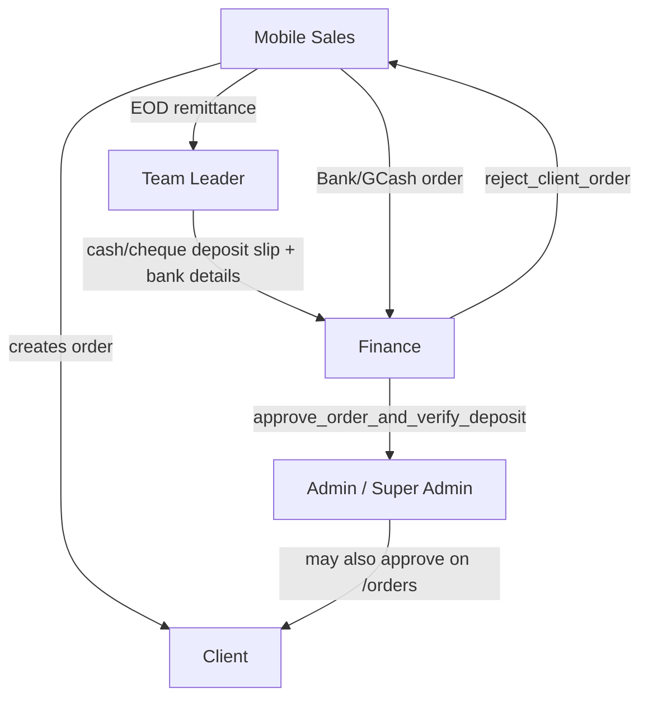

# Finance Role — Workflow Overview

This document describes how the **Finance** role (`finance`) works in the B1G Ordering System: tenant-scoped financial review, order final approval, cash deposit verification, payment configuration, and reporting.

For upstream flows (agents, leaders, deposits), see [mobile-sales-workflow.md](./mobile-sales-workflow.md) and [team-leader-workflow.md](./team-leader-workflow.md). For order correction policy, see [order-correction-options.md](./order-correction-options.md).

---

## Role identity

| Item | Detail |
|------|--------|
| Database role | `finance` |
| Display name | Finance |
| Hierarchy level | 70 (`getRoleLevel` in `roleUtils.ts`) |
| Scope | **Sales tenant** (`profiles.company_id` = one company) |
| Has personal inventory | No |
| Can lead a team | No |

Finance sits between field sales operations and **final** order approval. They do **not** sell, allocate stock, or manage clients directly.

**Provisioning:** typically created by **super admin** or **admin** via User Management (`/sales-agents`) with role `finance`.

**Not the same as:**

- **`admin` / `super_admin`** — broader tenant ops (inventory, clients, teams, procurement); admin can also approve orders on `/orders`.
- **`team_leader`** — records cash deposits and remittances; does **not** final-approve orders.
- **`warehouse`** — hub company; no client orders.

---

## Access model

- **Login redirect:** `/dashboard` (default in `RoleBasedRedirect.tsx`).
- **Sidebar:** `financeMenuItems` in `AppSidebar.tsx` only.
- **Route guard:** `/orders` is explicitly allowed for `admin` and `finance` in `usePermissions.ts`. Most other tenant routes are open to authenticated users; finance has **no** dedicated route whitelist (unlike `warehouse` or `executive`).
- **Payment settings:** `/finance/payment-settings` restricted to `super_admin` and `finance` (`App.tsx`).

**Cannot access (by design / menu):**

- Inventory allocation, stock requests, main inventory admin
- Clients database, team management, sales agent assignment
- Mobile sales / leader field menus (my inventory, my clients, tasks, etc.)
- Procurement PO creation (not in finance menu)
- War room, system administrator portal

Finance **can** open shared routes if navigated directly (e.g. `/clients`) unless blocked elsewhere; day-to-day work uses the finance menu only.

---

## Navigation (sidebar)

| Screen | Route | Purpose |
|--------|--------|---------|
| Dashboard | `/dashboard` | Finance KPIs: pending orders, deposits (`FinanceDashboard`) |
| Finance Page | `/finance` | Revenue/expense charts, transactions, deposit summaries |
| Order List | `/orders` | **Final approve/deny** client orders; bulk approve; import/export |
| Cash Deposits | `/inventory/cash-deposits` | **Read-only** company view of leader-recorded deposits |
| Payment Settings | `/finance/payment-settings` | Bank accounts, GCash, enabled payment methods |
| System History | `/system-history` | Financial audit trail (filtered tables) |
| Profile | `/profile` | Account |

---

## Organization model



Finance is the **final gate** for revenue recognition (`stage = admin_approved`) and for verifying linked **cash deposits** when orders include cash or cheque.

---

## Typical day — end to end

### 1. Dashboard (`/dashboard`)

**Component:** `FinanceDashboard` (`dashboardHooks.ts` → `useFinanceStats`)

Shows:

- **Pending revenue** — sum of orders in the pending queue (company-wide)
- **Deposits today** — cash/cheque portions from recent `cash_deposits` (split-aware)
- **Incoming orders** — recent pending orders (links to `/orders`)
- **Cash deposits** — recent deposit records (links to `/finance`)

Real-time refresh via Supabase subscriptions on `client_orders` and `cash_deposits`.

---

### 2. Order List (`/orders`) — primary workflow

**Page:** `OrdersPage.tsx`  
**Context:** `OrderContext.tsx` (company-scoped orders for finance via `isAdmin` visibility)

Finance is treated like admin for order visibility (`isAdmin` includes `finance`): **all company orders**.

#### Pending queue

Orders appear when `stage === 'finance_pending'` **or** `status === 'pending'` (includes cash/cheque still at `agent_pending` once ready).

UI label: **Pending Finance Review**.

#### Payment paths

| Payment at submit | Initial `stage` | Before finance can approve |
|-------------------|-------------------|----------------------------|
| Bank Transfer / GCash (full) | `finance_pending` | Review payment proof in order detail |
| Split includes Bank/GCash | `finance_pending` | Same |
| Cash / Cheque only | `agent_pending` | Leader **remittance** → **Cash Deposits** (deposit_id + bank account + reference + slip) |
| Split includes Cash/Cheque | `agent_pending` (unless bank leg triggers `finance_pending`) | Deposit required for cash/cheque **portion** |

#### Approve (Finance Approve)

**RPC:** `approve_order_and_verify_deposit(p_order_id)` (`create_approve_order_and_verify_deposit_function.sql`)

On success:

- `client_orders.status` → `approved`
- `client_orders.stage` → `admin_approved`
- **Main inventory** deducted (stock + allocated_stock per line)
- If order has cash/cheque component and `deposit_id`: linked **`cash_deposits`** marked **verified**

**UI gates** (finance cannot click approve until satisfied):

- Cash/cheque (full or split): `deposit_id` required
- Additionally: `depositBankAccount` (leader recorded bank details)
- Deposit slip visible when leader uploaded it

Button label when deposit ready: **Approve Order & Verify Deposit**.

#### Deny (Finance Deny)

**RPC:** `reject_client_order` via `updateOrderStatus(..., 'rejected')`  
Restores **agent inventory** (frontend + DB). See [order-correction-options.md](./order-correction-options.md).

#### Bulk approve

Finance-only **Bulk Approve Orders** — approve all pending orders for a selected agent (skips cash orders missing deposit).

#### Import / export

Finance (with admin/super_admin) may **import** historical orders (CSV/XLSX) and **export** order lists.

#### Not available to finance

- **Re-evaluate** (return to agent for revision) — **super admin only** on `/orders`
- Leader view on `/leader-orders` — team leader monitor mode only

---

### 3. Cash Deposits (`/inventory/cash-deposits`)

**Page:** `LeaderCashDepositsPage.tsx`  
**Finance mode:** `isFinanceOnly = true`

- **Company-wide** remittance/deposit view (not filtered to one leader’s team)
- **Cannot** record new deposits or upload slips (buttons hidden for finance)
- Monitors **Daily Cash Collections** and **verified deposit history**
- Leaders notify finance when deposit details are recorded (`sendNotificationToCompanyRoles` → `finance`, `admin`, `super_admin`)

**Verification** happens when finance **approves** the linked order on `/orders`, not via a separate “verify deposit” button on this page.

---

### 4. Finance Page (`/finance`)

**Page:** `FinancePage.tsx`

- **Revenue:** sum of `client_orders` where `stage = admin_approved`
- **Expenses:** approved `purchase_orders` + completed `financial_transactions` (expense type)
- Charts: last 6 months revenue vs expenses
- **Recent deposits** with cash/cheque split logic (same as dashboard; excludes v1-import orders before `2026-02-16` cutoff)
- Subscribes to `financial_transactions` for live updates

---

### 5. Payment Settings (`/finance/payment-settings`)

**Page:** `PaymentSettingsPage.tsx`  
**Hook:** `usePaymentSettings.ts` → `company_payment_settings`

Finance (and super admin) can configure:

- **Bank accounts** (name, account number) — used when leaders record deposits
- **GCash** — enable, number, display name, QR image
- **Method toggles** — cash, cheque, bank transfer enabled flags

Agents see these options when creating orders (bank transfer / GCash proof upload).

---

### 6. System History (`/system-history`)

**Page:** `SystemHistoryPage.tsx`

Finance title: **Transaction History**.

Filtered table list:

- `client_orders`, `cash_deposits`, `financial_transactions`, `purchase_orders`, `remittances_log`

RLS: `finance_audit_access` on `system_audit_log` (company-scoped financial logs).

---

## Order lifecycle (finance-centric)

```text
[Agent submits order]
        │
        ├─ Bank/GCash (or split with them) ──► finance_pending
        │
        └─ Cash/Cheque ──► agent_pending
                │
                ▼
        [Agent EOD remittance → Leader]
                │
                ▼
        [Leader: Cash Deposits — slip, bank, reference]
                │
                ▼
[Finance: /orders — Approve] ──► admin_approved (+ verify deposit if cash/cheque)
        │
        ├─ Deny ──► rejected / admin_rejected (+ restore agent stock)
        │
        └─ (Super admin only) Re-evaluate ──► needs_revision → agent edits → finance_pending
```

**Stages reference**

| `stage` | Finance action |
|---------|----------------|
| `finance_pending` | Review & approve/deny |
| `agent_pending` | Approve only when cash deposit requirements met |
| `leader_approved` | May appear in stats; typically superseded by finance queue |
| `admin_approved` | Done — counted in revenue |
| `needs_revision` | Wait for agent resubmit |
| `admin_rejected` / `leader_rejected` | Closed |

---

## Permissions vs other roles

| Capability | Finance | Team Leader | Admin | Super Admin |
|------------|:-------:|:-----------:|:-----:|:-----------:|
| Final approve client orders | Yes | No | Yes | Yes |
| Verify cash deposit (via approve) | Yes | No | Yes | Yes |
| Record cash deposits | No | Yes | Yes | Yes |
| Team remittances | No | Yes | Yes | Yes |
| Payment settings | Yes | No | No* | Yes |
| View all company orders | Yes | Team only | Yes | Yes |
| Bulk approve orders | Yes | No | No | No |
| Re-evaluate order | No | No | No | Yes |
| Import historical orders | Yes | No | Yes | Yes |
| Inventory / clients / teams | No | Limited | Yes | Yes |

\* Admin menu may include finance routes when impersonating or via direct URL; payment settings route allows `super_admin` and `finance` only.

---

## Happy path checklist

1. **Dashboard** — check pending revenue and new deposits.  
2. **Orders** — filter **Pending**; review payment proof (bank/GCash) or confirm leader deposit (cash/cheque).  
3. **Approve** — `approve_order_and_verify_deposit` (inventory + revenue + deposit verify).  
4. **Cash Deposits** — spot-check leader recordings if order detail unclear.  
5. **Payment Settings** — keep bank/GCash config current for the tenant.  
6. **Finance Page** — periodic revenue/expense review.  
7. **System History** — investigate disputes or audit questions.

---

## Code reference index

| Area | Primary files |
|------|----------------|
| Sidebar / menu | `AppSidebar.tsx`, `roleMenuHelper.ts` |
| Role helpers | `roleUtils.ts` (`canApproveFinance`, `canViewAllOrders`, `canViewCashDeposits`) |
| Permissions | `usePermissions.ts` (`/orders` gate) |
| Dashboard | `DashboardPage.tsx`, `FinanceDashboard.tsx`, `dashboardHooks.ts` (`useFinanceStats`) |
| Orders | `OrdersPage.tsx`, `OrderContext.tsx` |
| Approve RPC | `supabase/create_approve_order_and_verify_deposit_function.sql` |
| Reject RPC | `supabase/create_reject_client_order_function.sql` |
| Cash deposits | `LeaderCashDepositsPage.tsx` |
| Finance reports | `FinancePage.tsx` |
| Payment config | `PaymentSettingsPage.tsx`, `usePaymentSettings.ts`, `company_payment_settings` |
| Audit | `SystemHistoryPage.tsx` |
| Order stages | `client_orders.stage`, migration `20260427000000_add_needs_revision_stage.sql` |

---

## Known gaps / notes

- Finance **dashboard** pending query also includes `leader_approved` in `useFinanceStats` — align mentally with `/orders` pending filter (`finance_pending` or `status = pending`).
- **Cash deposits page** access message still says “team leaders, managers, and admins” but finance is allowed via `canViewCashDeposits` (read-only).
- **Reject** behavior and inventory restore are documented in `order-correction-options.md`; ensure DB `reject_client_order` matches product policy.
- **Re-evaluate** is super-admin-only; finance must **deny** or wait for super admin to return orders for revision.
- `FinancePage` / `financial_transactions` queries rely on RLS for tenant isolation — finance user must have correct `company_id`.
- Orders page subtitle mentions “purchase orders” in one branch — finance work here is **client orders**, not procurement POs.
