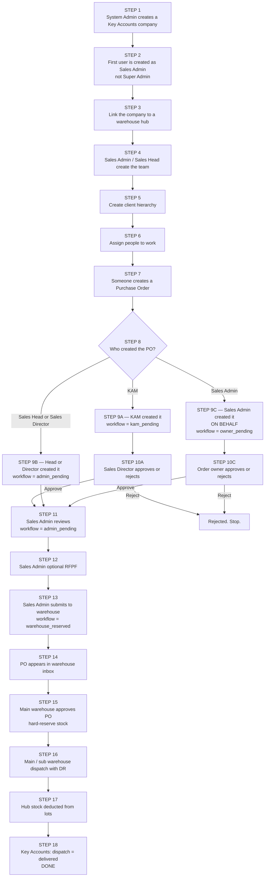
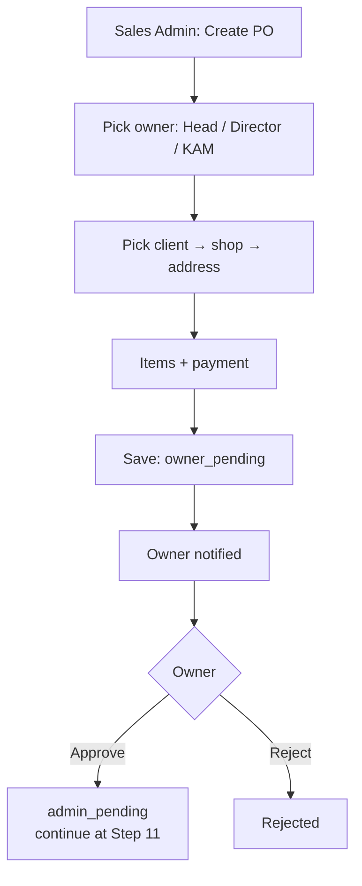

# Key Accounts — Step by Step

Start at **Step 1**. Follow the numbered boxes in order. Warehouse PO and PO on behalf are later steps on the same path, not separate processes.

Warehouse hub modules only: [warehouse-modules-flowcharts.md](./warehouse-modules-flowcharts.md)  
Standard Accounts (Warehouse → Super Admin → Team Leader → Mobile Sales) is a different chain. See [standard-account-warehouse-po-flowcharts.md](./standard-account-warehouse-po-flowcharts.md).

---

## Full flowchart (first step → last step)

---

## Step 1 — Create the Key Accounts company

**Who:** System Administrator

**Where:** SysAd dashboard → create company

Set `company_account_type = Key Accounts`.

This is the first step. Nothing else in Key Accounts exists until this company exists.

---

## Step 2 — First login user is Sales Admin

Creating that company also creates the first user.

For Standard Accounts this would be Super Admin. For Key Accounts it is **Sales Admin**.

Sales Admin is the company operator from here on (users, clients, POs, warehouse release).

---

## Step 3 — Link warehouse hub

**Who:** System Administrator

Connect the Key Accounts company to a warehouse company (`warehouse_company_assignments`).

All KA stock comes from this hub. There is no team-leader / agent inventory for Key Accounts.

---

## Step 4 — Create the team

**Who:** Sales Admin (or Sales Head)

Create:

1. Sales Head (if used)
2. Sales Directors
3. Key Account Managers
4. Key Account Accounting (optional, view only)

---

## Step 5 — Create client hierarchy

**Who:** Sales Admin / Sales Head / Director / KAM (KAM only for assigned clients later)

In order:

1. **Client** (parent account, e.g. SM)
2. **Shop / branch** under that client (e.g. SM Cebu)
3. **Delivery address** under that shop

A PO cannot be created until client + shop + address exist.

---

## Step 6 — Assign people

Two assignments:

1. **Director ↔ KAM** — who the Director oversees
2. **KAM ↔ Client** — which clients a KAM can order for

A KAM can only create POs for assigned clients.

---

## Step 7 — Create a Purchase Order

Setup is done. Ordering can start.

Whoever creates the PO picks:

1. Client
2. Shop
3. Delivery address
4. Warehouse location(s)
5. Products, qty, custom price
6. Payment proof (unless consignment)

Then **Step 8** depends on who clicked Create.

---

## Step 8 / 9 — Three create paths

### Path A — KAM creates (normal)

**Step 9A:** `workflow = kam_pending`

**Step 10A:** Sales Director approves or rejects.

- Approve → go to Step 11
- Reject → stop

### Path B — Sales Head or Sales Director creates

**Step 9B:** `workflow = admin_pending`

Skip Director review. Go to Step 11.

### Path C — Sales Admin creates = PO ON BEHALF

This is the on-behalf flow. It is not a separate product. It is Step 7 when Sales Admin is the creator.

**Step 9C**

1. Sales Admin must pick an **order owner**: Sales Head, Sales Director, or KAM
2. Client list follows that owner (KAM = only assigned clients)
3. Admin fills client → shop → address → items → payment
4. PO is saved as:
   - `created_by` = Sales Admin
   - `kam_id` = selected owner
   - `workflow = owner_pending`

**Step 10C:** Owner is notified and must approve or reject.

- Approve → items lock → go to Step 11 (Director is skipped)
- Reject → stop

Sales Admin cannot name themselves as owner.

---

## Step 11 — Sales Admin review

All three paths meet here: `workflow = admin_pending`.

Sales Admin is the last commercial gate before warehouse.

---

## Step 12 — Optional RFPF

Sales Admin can save / edit RFPF (limited edits).

---

## Step 13 — Submit to warehouse

**Who:** Sales Admin only

- `workflow = warehouse_reserved`
- `status` stays `pending` so warehouse can still Approve

Until this step, warehouse cannot process the PO.

---

## Step 14 — Warehouse sees the PO

Warehouse PO inbox (Key Accounts tab).

This is the warehouse PO flow. Same engine as Standard Account transfer POs. Warehouse did not create the PO; they fulfill it.

---

## Step 15 — Main warehouse approves

**Who:** Main warehouse user only (sub warehouse cannot approve)

- Checks stock per line location
- Hard-reserves stock
- `status = approved_for_fulfillment`

Sub warehouse waits until Main has approved, then can dispatch only their location.

---

## Step 16 — Dispatch

Main and/or sub warehouse ship their lines:

- DR number
- Rider / plate
- Photos
- Warehouse signature

Partial dispatch is allowed → multiple DRs.

---

## Step 17 — Stock leaves the hub

On dispatch:

- FIFO lots consumed
- Hub on-hand deducted

For Key Accounts, buyer inventory is **not** credited. There is no Team Leader receive step.

---

## Step 18 — Delivered. Done.

When all locations are dispatched:

- `workflow = delivered` (or `partial_delivered` if still open)
- Key Accounts treats **dispatch as delivery**

Standard Accounts would next have the assigned Team Leader receive the DR (signature required; received qty cannot exceed dispatched). If there is a shortfall, the TL reports it and warehouse investigates in Delivery Shortages. Key Accounts does not — dispatch completes delivery.

---

## Numbered list (same flow)

1. System Admin creates Key Accounts company
2. First user is Sales Admin
3. Link warehouse hub
4. Create Head / Directors / KAMs
5. Create client → shop → address
6. Assign Director↔KAM and KAM↔client
7. Create PO
8. Branch by creator
9. KAM → Director approval **or** Head/Director → Admin **or** Sales Admin on-behalf → owner approval
10. Approver accepts or rejects
11. Sales Admin review
12. Optional RFPF
13. Sales Admin submits to warehouse
14. Warehouse inbox
15. Main warehouse approves and reserves
16. Dispatch with DR
17. Hub stock deducted
18. Delivered
