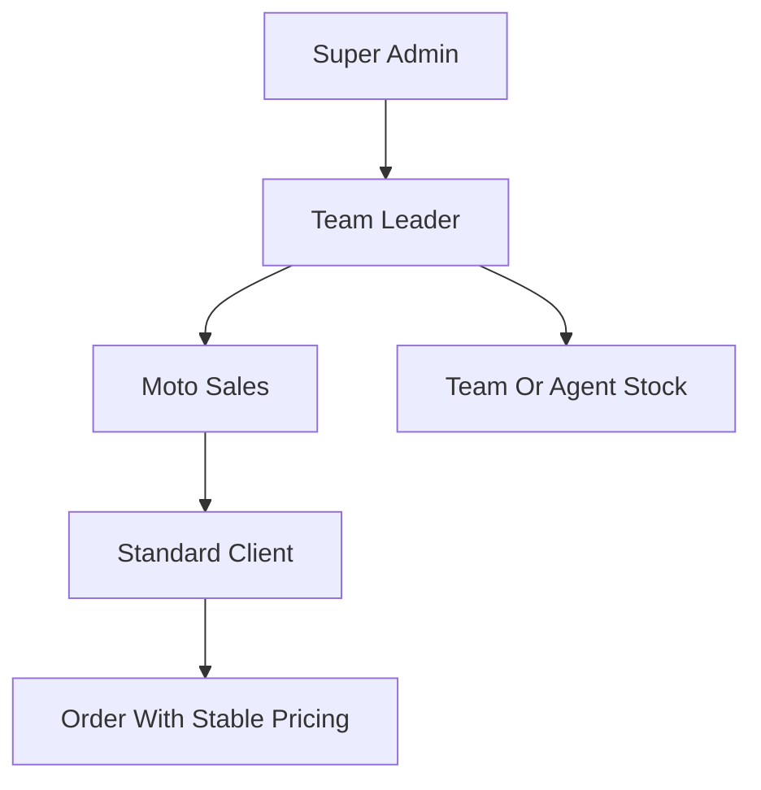
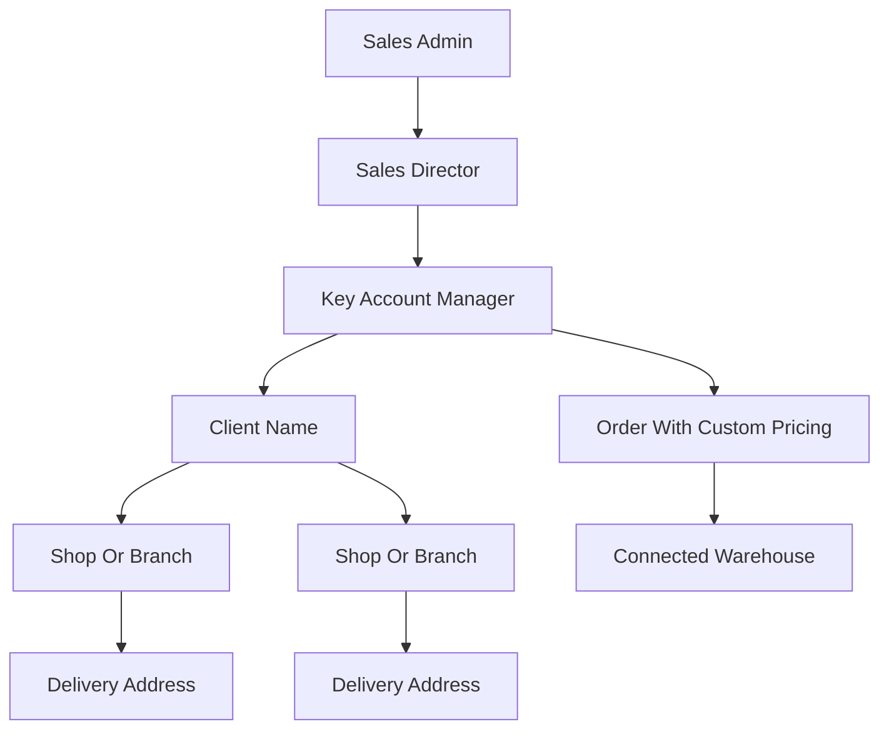
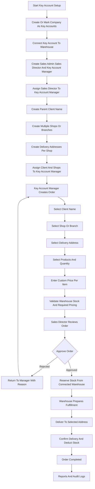

name: Key Account Workflow
overview: Create a Key Account workflow parallel to Moto Sales, with its own role hierarchy, client/shop/address model, warehouse-linked stock flow, and mandatory custom pricing per transaction.
todos:
  - id: confirm-rules
    content: Confirm Key Account role names, approval rules, and whether Sales Admin gives final approval or only supervises.
    status: pending
  - id: data-model
    content: Design database changes for roles, client-shop-address hierarchy, warehouse connection, assignments, custom pricing, and audit trail.
    status: pending
  - id: permissions
    content: Define role-based access rules for Sales Admin, Sales Director, and Key Account Manager.
    status: pending
  - id: order-flow
    content: Design Key Account order creation, approval, warehouse reservation, and fulfillment flow.
    status: pending
  - id: ui-flow
    content: Plan screens for Sales Admin setup, Sales Director approvals, and Key Account Manager operations.
    status: pending
  - id: testing
    content: Create test checklist covering both unchanged Moto Sales behavior and new Key Account behavior.
    status: pending
isProject: false
---

# Key Account Company Type Workflow

## Target Business Flow

Standard Account / Moto Sales:

Key Account:

## End-to-End Key Account Flow Chart

## Development Guide

1. Define the Key Account role model.
   - Add or map these roles: `sales_admin`, `sales_director`, and `key_account_manager`.
   - Keep the hierarchy concept similar to `super_admin -> team_leader -> mobile_sales`, but do not mix their approval permissions.
   - Existing role logic likely touches [schema.sql](schema.sql), [src/types/database.types.ts](src/types/database.types.ts), and auth/profile checks across feature pages.

2. Define the Key Account company setup.
   - Use the existing `companies.company_account_type` concept, which already supports `Key Accounts` and `Standard Accounts`.
   - Add company-level configuration for the warehouse connected to that Key Account company.
   - Expected rule: all Key Account stock requests and order fulfillment should route through the connected warehouse, not through Moto Sales/team leader inventory.

3. Create the Key Account client data model.
   - Separate the client name from shops/branches and delivery addresses.
   - Suggested structure:
     - `key_account_clients`: parent client, for example `SM`, `Robinsons`, `Watsons`.
     - `key_account_shops`: stores/branches under that client, for example `SM Cebu`, `SM Davao`.
     - `key_account_delivery_addresses`: one or many addresses per shop.
   - Keep `client_id`, `shop_id`, and `delivery_address_id` on each order so invoices, delivery, reports, and history remain traceable.

4. Create the Key Account assignment model.
   - Sales Admin manages setup.
   - Sales Director supervises Key Account Managers.
   - Key Account Manager owns assigned clients/shops.
   - Suggested assignment levels:
     - Director can view all assigned managers under them.
     - Manager can view only assigned clients, shops, addresses, orders, and stock activity.
     - Sales Admin can view and configure all Key Account data inside the company.

5. Update stock routing.
   - Standard Accounts can continue using the existing stock request concept: Mobile Sales requests stock, Team Leader forwards or adds quantity, Admin approves.
   - Key Accounts should use warehouse-linked stock:
     - Warehouse holds available stock.
     - Key Account Manager creates order or stock reservation against connected warehouse.
     - Warehouse stock is reserved/allocated for the order.
     - Stock is deducted when delivery is confirmed or fulfilled.
   - Reuse the existing warehouse transfer concepts in [src/features/orders/PurchaseOrderContext.tsx](src/features/orders/PurchaseOrderContext.tsx) and purchase order types in [src/features/orders/types.ts](src/features/orders/types.ts) where possible.

6. Enforce custom pricing for Key Account transactions.
   - Standard Accounts may continue using stable pricing such as `rsp_price`, `dsp_price`, or configured allowed pricing.
   - Key Accounts should require manual/custom unit price per order item.
   - Do not auto-select RSP/DSP for Key Account orders.
   - Store the final agreed price on the order item so future price changes do not affect historical transactions.
   - Existing pricing fields to consider include `client_orders.pricing_strategy` and item-level unit prices in [schema.sql](schema.sql).

7. Create the Key Account order flow.
   - Key Account Manager selects:
     - Parent client name.
     - Shop/branch.
     - Delivery address.
     - Connected warehouse.
     - Products and quantities.
     - Custom price per item.
   - System validates:
     - Client belongs to Key Account company.
     - Shop belongs to selected client.
     - Address belongs to selected shop.
     - Warehouse is connected to the Key Account company.
     - Custom price is entered for every item.
     - Warehouse has enough available stock or allows backorder if that is a business rule.

8. Create the approval workflow.
   - Recommended first version:
     - Key Account Manager creates order as `manager_pending`.
     - Sales Director reviews custom pricing, client/shop/address, and quantities.
     - Sales Director approves or rejects.
     - Sales Admin has final visibility and can override, cancel, or audit.
     - Warehouse receives approved fulfillment request.
   - If finance approval is needed later, add it after Sales Director approval rather than mixing it into the first release.

9. Create screens and navigation.
   - Sales Admin:
     - Manage Key Account companies/settings.
     - Manage connected warehouses.
     - Manage Sales Directors and Key Account Managers.
     - View all Key Account orders and reports.
   - Sales Director:
     - View assigned Key Account Managers.
     - Approve/reject orders.
     - Monitor custom pricing and warehouse allocation.
   - Key Account Manager:
     - Manage assigned clients, shops, and delivery addresses.
     - Create orders with custom pricing.
     - Track order status and delivery.

10. Create reporting and audit requirements.
   - Reports should group by parent client, shop/branch, delivery address, manager, warehouse, and product.
   - Audit logs should capture custom price changes, approval decisions, stock allocation, stock deduction, and delivery confirmation.
   - This is important because Key Account pricing is transaction-based and may differ every time.

## Suggested Development Steps

1. Confirm exact role names and permissions.
2. Add database support for Key Account roles, client/shop/address hierarchy, warehouse connection, assignments, and order fields.
3. Update TypeScript database types.
4. Add Key Account access-control helpers.
5. Build Sales Admin setup screens.
6. Build Sales Director approval screens.
7. Build Key Account Manager client/shop/address and order creation screens.
8. Add warehouse stock reservation and fulfillment behavior.
9. Enforce custom pricing validation on frontend and backend.
10. Add reports and audit history.
11. Test Standard Account flow to make sure Moto Sales behavior did not change.
12. Test Key Account flow from client setup to warehouse fulfillment.

## Recommended First Release Scope

Build this in phases:

1. Phase 1: Data model and role permissions.
2. Phase 2: Client, shop, and delivery address management.
3. Phase 3: Key Account order creation with required custom pricing.
4. Phase 4: Sales Director approval and warehouse stock reservation.
5. Phase 5: Fulfillment, reporting, and audit logs.

Keep Standard Account and Key Account flows separated by `company_account_type`, but reuse common product, inventory, order item, and warehouse utilities where they already fit.