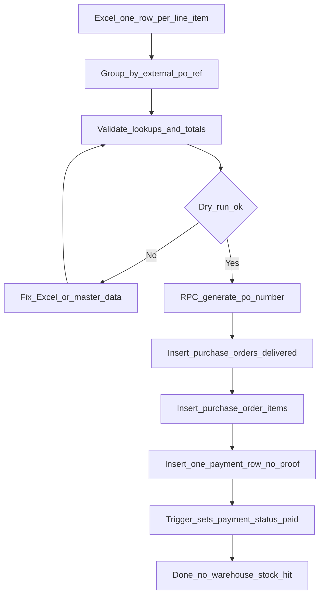

# Key Account Historical PO Import

## Overview

This guide defines how to import **legacy Key Account purchase orders** into OMS as already completed business.

Imported POs must:

- Get an **auto-generated** system `po_number` via `generate_po_number()` (same as normal PO create)
- Appear as **delivered / fulfilled** (no warehouse queue work)
- Include a **payment ledger row** so analytics treat them as **fully paid**
- Appear as **commissioned** (`commissioned_at` + `commissioned_by`) so they do not sit in the ready-to-commission list
- Skip payment proof photos (`proof_storage_path = null`)
- **Not** deduct warehouse stock or run reserve / fulfill / dispatch RPCs

Use this for old POs (for example ~1,800 records) imported **month by month** (June first, then next months).

> **Status:** In-app importer is available at **Historical Import** (Sales Admin / Sales Head). Dry-run first, then import delivered + fully paid + commissioned POs. Warehouse stock is not deducted.

---

## Why bypass warehouse fulfillment

Normal Key Account create flow starts pending approval, then warehouse reservation, fulfill, dispatch, and delivery.

Historical POs were already delivered outside this system. Replaying that path would:

- Push old POs into the warehouse queue
- Incorrectly reduce current stock
- Create fake DR / RFPF / delivery proof work

Instead, insert POs directly as completed and paid.

| Live create (today) | Historical import (target) |
|---------------------|----------------------------|
| `status = pending` | `status = fulfilled` |
| `workflow_status = kam_pending` / `admin_pending` / … | `workflow_status = delivered` |
| `key_account_payment_status = unpaid` (then payments) | `key_account_payment_status = paid` |
| Payment proof required (non-consignment) | No proof |
| Warehouse reserve / fulfill | **Skipped** |

A PO counts as delivered in analytics when:

```text
status = 'fulfilled' AND workflow_status = 'delivered'
```

---

## Prerequisites

Before importing a month file, these must already exist in OMS and match Excel values:

1. Key Account **clients** (`key_account_clients.client_code`)
2. **Shops** under those clients (`key_account_shops.shop_code`)
3. **Delivery addresses** (`key_account_delivery_addresses.address_label`, scoped to shop)
4. **KAM (or owner) profiles** (`profiles.email` → `kam_id`)
5. **Product variants** with stable **SKU** (`product_variants.sku` preferred)
6. **Warehouse location** names that resolve to linked warehouse locations
7. Company context: importing user’s `company_id` is Key Accounts

Fix mismatches in master data first. Bad codes cause failed rows.

---

## Import flow



Per `external_po_ref` group:

1. Resolve client / shop / address / KAM / warehouse / variants
2. Call `generate_po_number()`
3. Insert `purchase_orders` (delivered + Key Accounts header)
4. Insert all `purchase_order_items` for that PO
5. Insert **one** `purchase_order_key_account_payments` row (full amount, no proof)
6. Rely on payment-status trigger to set `key_account_payment_status = paid`
7. Do **not** call warehouse reserve / fulfill / dispatch; do **not** create open `warehouse_transfer_location_status` pending rows that put work in queue
8. Set `commissioned_at` (same date as payment / `order_date`) and `commissioned_by` (importer) so the PO is already commissioned

Optional audit: log a PO history event such as `Imported historical PO (pre-system)` and put `Legacy: {external_po_ref}` in `notes`.

---

## Excel format

### Layout

- **One row per line item**
- First line of a PO: fill `external_po_ref`, dates, client/shop/address, `kam_email`, `rfpf_number`
- Extra lines of the same PO may leave those cells **blank** (fill-down). A new `external_po_ref` starts the next PO
- `brand_name` may be blank while the brand is unchanged; write it again when the brand changes
- Repeating every header cell on every line still works
- System `po_number` is **not** in Excel (auto-generated)
- No UUID columns (`id`, `company_id`, `purchase_order_id`, `variant_id`, etc.)

### Column list

| Excel column | Type | Required | Maps to |
|--------------|------|----------|---------|
| `external_po_ref` | text (grouping) | **Yes (first line)** | Groups lines; store in `notes` as `Legacy: …` (not system `po_number`) |
| `order_date` | date `YYYY-MM-DD` | **Yes** | `purchase_orders.order_date` |
| `expected_delivery_date` | date | No | `purchase_orders.expected_delivery_date` (default = `order_date`) |
| `client_code` | **lookup → id** | **Yes** | → `key_account_client_id` |
| `shop_code` | **lookup → id** | **Yes** | → `key_account_shop_id` |
| `address_label` | **lookup → id** | **Yes** | → `key_account_address_id` |
| `kam_email` | **lookup → id** | **Yes** | → `kam_id` |
| `warehouse_location_name` | **lookup → id** | Recommended | → `warehouse_location_id` (+ `warehouse_company_id`) |
| `payment_terms` | text | Recommended | `key_account_payment_terms` (e.g. `COD`) |
| `discount` | number | No | `purchase_orders.discount` (default `0`) |
| `rfpf_number` | text | Recommended | `purchase_orders.rfpf_number` (first line of the PO; later lines may be blank) |
| `tax_rate` | number | No | `purchase_orders.tax_rate` (default `0`) |
| `sku` | **lookup → id** | **Yes** | → `purchase_order_items.variant_id` |
| `brand_name` | text helper | Recommended | Hub brand. Fill when the brand starts or changes; later variants may leave it blank |
| `variant_name` | text helper | Recommended | Helps resolve variant |
| `quantity` | number | **Yes** | `purchase_order_items.quantity` |
| `unit_price` | number | **Yes** | `purchase_order_items.unit_price` |
| `line_total` | number | Recommended | `purchase_order_items.total_price` (or `qty × unit_price`) |
| `payment_amount` | number | **Yes** | One payment `amount` per PO (= PO total) |
| `payment_method` | enum text | **Yes** | `GCASH` \| `BANK_TRANSFER` \| `CASH` \| `CHEQUE` |
| `payment_date` | date | **Yes** | Payment `created_at` (analytics month) |
| `bank_type` | enum text | If bank | `Unionbank` \| `BPI` \| `PBCOM` when method is `BANK_TRANSFER` |
| `po_order_kind` | enum text | No | `standard` (default) or `consignment` |
| `notes` | text | No | `purchase_orders.notes` |

### Columns that resolve to an id (UUID)

1. `client_code` → `key_account_client_id`
2. `shop_code` → `key_account_shop_id`
3. `address_label` → `key_account_address_id`
4. `kam_email` → `kam_id`
5. `warehouse_location_name` → `warehouse_location_id`
6. `sku` (+ optional `brand_name` / `variant_name`) → `variant_id`

Everything else is plain text / date / number — not ids.

### Auto-created ids (never in Excel)

- `purchase_orders.id`
- `purchase_order_items.id`
- `purchase_order_key_account_payments.id`
- `po_number` (via `generate_po_number`)
- `company_id`, `created_by`, `warehouse_company_id` (session / linked warehouse)

---

## `purchase_orders` field map

### From Excel (after lookup / as-is)

| DB field | Source |
|----------|--------|
| `order_date` | Excel `order_date` |
| `expected_delivery_date` | Excel or = `order_date` |
| `key_account_client_id` | lookup `client_code` |
| `key_account_shop_id` | lookup `shop_code` |
| `key_account_address_id` | lookup `address_label` |
| `kam_id` | lookup `kam_email` |
| `warehouse_location_id` | lookup `warehouse_location_name` |
| `key_account_payment_terms` | Excel `payment_terms` |
| `discount` | Excel `discount` |
| `rfpf_number` | Excel `rfpf_number` (optional) |
| `tax_rate` | Excel `tax_rate` |
| `po_order_kind` | Excel or `standard` |
| `notes` | Excel `notes` + legacy ref |

### Computed from line items

| DB field | Rule |
|----------|------|
| `subtotal` | Sum of line totals |
| `tax_amount` | From `tax_rate` × taxable base |
| `total_amount` | `subtotal - discount + tax_amount` |

### Fixed / auto on historical import

| DB field | Value |
|----------|-------|
| `id` | New UUID |
| `po_number` | **`generate_po_number()`** |
| `company_id` | Current company |
| `supplier_id` | `null` |
| `fulfillment_type` | `warehouse_transfer` |
| `company_account_type` | `Key Accounts` |
| `status` | `fulfilled` |
| `workflow_status` | `delivered` |
| `key_account_payment_mode` | `full` |
| `key_account_payment_status` | Ends as `paid` after payment insert + trigger |
| `commissioned_at` | Same timestamp as historical payment (`order_date`) |
| `commissioned_by` | Importing user |
| `created_by` | Importing user |
| `custom_pricing_confirmed` | `true` |
| `rfpf_number` | Excel `rfpf_number` (or `null` if blank) |
| `dr_number` | `null` unless added later |
| `source_rebate_id` | `null` |
| `assigned_team_leader_id` | `null` |
| Approval stamps (`approved_*`, `admin_approved_*`, `director_approved_*`) | Optional; may leave `null` for historical |

Do **not** import live in-progress shapes such as `warehouse_reserved` + `pending` + `partial` payment unless that is intentional for unfinished old work. Historical delivered/paid import uses the fixed values above.

---

## `purchase_order_items` field map

Items are **not** a separate Excel sheet. Each Excel row becomes one item under its `external_po_ref` group.

| DB field | In Excel? | Source |
|----------|-----------|--------|
| `id` | **No** | Auto UUID |
| `company_id` | **No** | Same as PO / company context |
| `purchase_order_id` | **No** | New PO `id` after header insert |
| `variant_id` | **No (as UUID)** | Lookup Excel `sku` (helpers: brand/variant name) |
| `quantity` | **Yes** | Excel `quantity` |
| `unit_price` | **Yes** | Excel `unit_price` |
| `total_price` | Optional | Excel `line_total` or `quantity × unit_price` |
| `warehouse_location_id` | **No (as UUID)** | Same location resolved for the PO header |
| `created_at` | **No** | Default `now()`, or align to `order_date` if desired |

Warehouse location on items must satisfy transfer-item rules when `fulfillment_type = warehouse_transfer` (location required on items in normal flow). Historical import should set the looked-up location on each item.

---

## Payment rules

Analytics and dashboards read `purchase_order_key_account_payments` (amount, settlement discount, `created_at`). Header `key_account_payment_status` alone is not enough for payment history / paid revenue splits.

### Per PO (one payment row)

| Payment field | Value |
|---------------|-------|
| `purchase_order_id` | New PO id |
| `company_id` | Company context |
| `amount` | Excel `payment_amount` (= PO `total_amount`) |
| `settlement_discount` | `0` |
| `payment_method` | Excel enum |
| `bank_type` | Only for `BANK_TRANSFER`; else `null` |
| `proof_storage_path` | **`null`** (no proof photo) |
| `created_at` | From Excel `payment_date` (so monthly analytics land in the correct month) |
| `recorded_by` | Importing user (optional) |

### Totals check

```text
payment_amount ≈ sum(line_total) - discount + tax_amount
```

Allow a small rounding tolerance (for example 0.01). Reject the group if amount does not cover `total_amount` (status would stay `partial` / `unpaid`).

### Payment method enums

- `GCASH`
- `BANK_TRANSFER` (requires `bank_type`: `Unionbank` | `BPI` | `PBCOM`)
- `CASH`
- `CHEQUE`

Using `CASH` for all historical rows is acceptable when the real method is unknown.

### Consignment note

Normal create skips first payment for `po_order_kind = consignment`. For this historical import, unless an old PO was truly unpaid consignment float, prefer `standard` + full payment so analytics show paid.

---

## Operator checklist (month by month)

### Phase 1 — Prep master data

1. Confirm clients / shops / addresses / KAMs / SKUs / warehouse locations exist and codes match.
2. Decide month batch (e.g. all June `order_date`s).

### Phase 2 — Prepare Excel

3. Build one row per line item with the columns above.
4. First line of a PO has `external_po_ref` (and RFPF). Extra lines may leave those blank until a new ref starts the next PO.
5. Set `payment_amount` = PO total on each line of that PO (importer inserts **one** payment).
6. Spot-check: line sums − discount + tax = `payment_amount`.

### Phase 3 — Dry run / pilot (when importer exists)

7. Dry-run: validate lookups and totals; insert nothing; export error report.
8. Fix Excel / master data until dry-run is clean.
9. Import a pilot of 5–10 POs.
10. Verify pilot (see checklist below).
11. Import remainder of the month.
12. Repeat for the next month.
13. Do not re-import the same `external_po_ref` without a duplicate guard.

### Phase 4 — Aftercare

14. Keep Excel files and error logs as audit trail.
15. Search old numbers via `notes` containing `Legacy: {external_po_ref}`.

---

## Sample Excel (2 lines → 1 PO + 1 payment)

Header fields only need to appear on the first line. Repeating them on every line still works.

```text
external_po_ref,order_date,client_name,shop_name,address_label,brand_name,variant_name,quantity,unit_price,line_total,kam_email,discount,rfpf_number,notes
LEGACY-JUN-001,2025-06-10,ABC Trading Inc.,Main Branch,Main Receiving,BrandA,VariantA,10,100,1000,kam@b1g.com,0,RFPF-JUN-001,First line of the PO
,,,,,,VariantB,5,100,500,,,Same PO and brand — leave ref / brand / RFPF blank
```

Expected result for `LEGACY-JUN-001`:

1. New `po_number` like `PO-YYYYMMDD-####` from `generate_po_number()`
2. Header: Key Accounts, warehouse_transfer, `fulfilled` / `delivered`, commissioned
3. Two item rows (SKU-001 qty 10, SKU-002 qty 5)
4. One payment amount `1500`, no proof → `key_account_payment_status = paid`
5. `commissioned_at` / `commissioned_by` set (same stamp as **Mark as commissioned**)
6. No warehouse stock deduction / no open warehouse to-do

---

## Verification checklist

After pilot or month import, confirm:

- [ ] New auto `PO-…` number appears (not the legacy ref as system number)
- [ ] `status = fulfilled` and `workflow_status = delivered`
- [ ] Client / shop / address / KAM / items look correct
- [ ] Line quantities and prices match Excel
- [ ] `key_account_payment_status = paid`
- [ ] `commissioned_at` and `commissioned_by` are set (Commissioned badge on the PO list)
- [ ] Payment history shows cash amount; no proof required
- [ ] Payment date falls in the intended analytics month
- [ ] Key Account analytics / dashboard paid revenue includes these POs for that month
- [ ] Warehouse fulfillment queue does **not** list these POs as pending work
- [ ] Current warehouse stock was **not** reduced by the import

---

## Out of scope / future implementation

This doc does **not** implement:

- In-app Excel upload UI
- Dry-run validator service
- Duplicate `external_po_ref` detection table
- Batch RPC for historical insert

When building the importer later, follow this spec and mirror create-flow pieces where safe:

- PO number: `supabase.rpc('generate_po_number')` (see Key Account create page)
- Items insert into `purchase_order_items` after PO header insert
- Payments into `purchase_order_key_account_payments` with nullable `proof_storage_path`
- **Do not** call approve / reserve / fulfill warehouse RPCs for these rows

Suggested future placement: Sales Admin–only action on Key Account Purchase Orders (or a dedicated admin import tool), with dry-run first.
