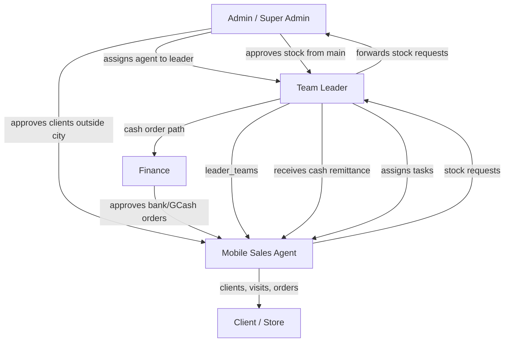

# Mobile Sales Role — Workflow Overview

This document describes how the **Mobile Sales** role (`mobile_sales`) works in the B1G Ordering System: navigation, daily operations, integrations with team leaders, finance, and admins, and key code references.

For related behavior, see also [order-correction-options.md](./order-correction-options.md).

---

## Role identity

| Item | Detail |
|------|--------|
| Database role | `mobile_sales` |
| Display name | Mobile Sales Agent (`src/lib/roleUtils.ts`) |
| Hierarchy level | 40 (lowest operational sales role in `getRoleLevel`) |
| Has personal inventory | Yes (`hasInventory('mobile_sales')`) |
| Reports to | Team Leader via `leader_teams` (`agent_id` → `leader_id`) |

Legacy role `sales_agent` is still handled in several places the same way as `mobile_sales`; production accounts should use `mobile_sales`.

---

## Navigation (sidebar)

Mobile sales use the **agent menu** in `src/features/shared/components/AppSidebar.tsx` (`agentMenuItems`).

| Screen | Route | Purpose |
|--------|--------|---------|
| Dashboard | `/dashboard` | Personal KPIs: orders, clients, sales |
| My Inventory | `/my-inventory` | Stock on hand, remittance, returns |
| Request Inventory | `/inventory/mobile-request` | Request stock from team leader |
| My Clients | `/my-clients` | Register and manage assigned clients |
| My Orders | `/my-orders` | Create and track client orders |
| My Activity | `/system-history` | Own audit / history |
| Calendar | `/calendar` | Tasks, visits, follow-ups |
| Profile | `/profile` | Account settings |
| Attendance | `/attendance` | Hub check-in / check-out |

**Not in sidebar (no access or leader/admin only):** team management, admin client database, finance order list (`/orders`), analytics, war room, leader remittances, pending client approval (admin UI), manager dashboards.

**Note:** `/tasks` is registered in `src/App.tsx` and mobile sales can use it if they navigate directly, but **Calendar** is the primary task UI in the menu. `src/lib/roleMenuHelper.ts` lists `/inventory/request` for agents; the live sidebar points agents to `/inventory/mobile-request` (leader stock requests use `/inventory/request` or `/leader-inventory/request`).

---

## Organization model



- **Assignment:** `leader_teams` links `agent_id` → `leader_id` (`useMyLeader` in `src/features/inventory/requestHooks.ts`).
- **Hubs:** Mobile sales can read hubs for attendance (geofencing); RLS policy `Hubs: mobile_sales read leader hub`.
- **Unassigned leader:** Stock requests and end-of-day remittance show warnings when no leader is linked.

---

## Typical day — end-to-end

### 1. Start of day — Attendance (`/attendance`)

**Page:** `src/features/agent-attendance/page/AgentAttendancePage.tsx`  
**UI:** `src/features/agent-attendance/component/AgentAttendanceList.tsx`

Only `mobile_sales` users run the check-in flow:

1. Select a **hub** (hubs visible per RLS).
2. **Time in:** selfie + GPS; distance checked against `hub.radius_meter` (note required if outside range).
3. Row stored in `agent_attendances` for Manila **business date**.
4. **Time out:** agent may only update `time_out` on their own row (DB trigger / RLS).
5. **Absent / non-working:** nightly job can insert `absent` (Mon–Sat) or `non_working` (Sun) if no row exists (`mark_absent_attendance_for_business_date`).

Team leaders view team attendance at `/team-attendances`; mobile sales only manage their own record.

---

### 2. Field work — Clients (`/my-clients`)

**Page:** `src/features/clients/MyClientsPage.tsx`

Agents own clients where `clients.agent_id = auth user id`.

**Add client**

- Registration includes photos, location, shop type, brands, COR, etc.
- **Auto-approved** if client city is in the agent’s assigned cities.
- **Pending approval** if city is outside assigned cities → admin must approve before orders; team leader receives notification (`sendNotification`, type `new_client`).
- Mobile sales **cannot delete** clients (delete action hidden when `user.role === 'mobile_sales'`).

**Manage**

- View and edit own clients.
- Visit history and related data tied to the client.

---

### 3. Tasks and visits — Calendar (`/calendar`)

**Page:** `src/features/calendar/CalendarPage.tsx`

- Sees **only own** tasks (`agent_id` filter), not full team view.
- Team leader / manager assign tasks; **only mobile sales** can mark assigned tasks **completed** on the calendar.
- Can create **daily tasks**; date/time auto-set at creation (no manual date picker for agents).
- **Record visit:** photo, GPS, notes — often linked to client/task.

Alternative: `/tasks` (`src/features/sales-agents/TasksPage.tsx`) filters `agent_id` for mobile sales but is not in the agent sidebar.

---

### 4. Stock — Request and hold

#### Request stock (`/inventory/mobile-request`)

**Page:** `src/features/inventory/MobileSalesStockRequestPage.tsx`

1. Agent requests quantities against **team leader’s** available inventory (`useLeaderInventorySummary`), not main warehouse.
2. Requests stored in `stock_requests` with statuses such as:
   - `pending` → `approved_by_leader` → `approved_by_admin` → `fulfilled` (or `rejected`)
3. Team leader may **add quantity** when forwarding to admin (combined request — see `supabase/migrations/implement_stock_preorder_system.sql`).
4. After admin approval and leader distribution, stock appears in **agent inventory** (`agent_inventory`).

#### My Inventory (`/my-inventory`)

**Page:** `src/features/inventory/MyInventoryPage.tsx`  
**Context:** `src/features/inventory/AgentInventoryContext.tsx`

- View stock levels (available / low / out).
- Order creation **deducts** agent inventory (`OrderContext.addOrder`).
- **Return inventory** to team leader (`ReturnInventoryDialog`).
- **Return requests** section (`MyReturnRequestsSection`) for mobile sales only.
- “Return to Main” is for team leaders, not mobile sales.

---

### 5. Selling — Orders (`/my-orders`)

**Page:** `src/features/orders/MyOrdersPage.tsx`  
**Context:** `src/features/orders/OrderContext.tsx` (filters orders by `agent_id` for `mobile_sales`)

**Create order** (approved clients only)

- Line items from agent inventory.
- **Pricing:** company `mobile_sales_allowed_pricing` (configured in System Settings; default often `rsp_price` only).
- **Payment:** Cash, Cheque, Bank Transfer, GCash, or Split.
- Client signature and payment proof as required.

**Initial order `stage` by payment** (`MyOrdersPage.tsx`)

| Payment | Initial `stage` | Next approver |
|---------|-----------------|---------------|
| Cash / Cheque only | `agent_pending` | Team leader (cash deposit handling) |
| Bank Transfer / GCash (or split includes them) | `finance_pending` | Finance |

**Lifecycle (simplified)**

```
agent_pending → leader review → leader_approved | leader_rejected
→ finance_pending → admin_approved (final) | admin_rejected | needs_revision
```

**Display statuses** (UI helper `getDisplayStatus`): Pending, Approved by Leader, Approved, Rejected, Needs Revision.

**Dashboard stats** (`useAgentStats` in `src/features/dashboard/dashboardHooks.ts`)

- **Overall sales:** all orders for the agent.
- **Approved sales:** `stage === 'admin_approved'`.
- **Pending sales:** `agent_pending`, `finance_pending`, `leader_approved`, etc.

---

### 6. End of day — Cash remittance (`/my-inventory`)

**Reminder:** `src/features/shared/components/AgentRemittanceReminder.tsx` — 6:30 PM daily for `mobile_sales` only.

**Flow:** “End of Day Cash Remittance” dialog on My Inventory

1. Confirm **unsold stock** (remains with agent).
2. Confirm **sold** / today’s cash (and related) orders.
3. **Signature** and submit **cash proceeds** to team leader.
4. Unsold inventory is **not** remitted with cash; only proceeds go to leader.
5. Requires assigned leader/manager.

Leader processes remittances on leader inventory / team remittance screens.

---

## Dashboard (`/dashboard`)

**Page:** `src/features/dashboard/DashboardPage.tsx`  
**Hook:** `useAgentStats` — enabled for `mobile_sales` and `sales_agent`

Shows:

- My orders count  
- My clients count  
- Overall / approved / pending sales  
- Recent activity notifications  
- Company top performers (read-only context)

Other roles redirect (e.g. manager → `/manager-dashboard`); mobile sales stay on the agent dashboard.

---

## Permissions vs team leader

| Capability | Mobile Sales | Team Leader |
|------------|:------------:|:-----------:|
| See only own orders/clients | Yes | No (team + own) |
| Auto-approve own client adds | City match only | Always |
| Delete clients | No | Yes |
| Assign tasks to agents | No | Yes |
| Forward stock requests to admin | No | Yes |
| Receive agent cash remittance | No | Yes |
| View team attendance | No | Yes |
| Analytics / War Room | No | Partial (leader) |
| Finance order list `/orders` | No | No (finance/admin) |
| Pricing strategies | `mobile_sales_allowed_pricing` | `team_leader_allowed_pricing` |

Central helpers: `src/lib/roleUtils.ts`, `src/hooks/usePermissions.ts` (route checks are minimal for agents; most scoping is query/RLS).

---

## Data and security (summary)

- Queries and RLS generally scope to `auth.uid()` for orders, clients, inventory, and attendance.
- Sub-team visibility via `leader_teams` / `sub_teams` computed functions (`mobile_sales_ids`, `mobile_sales_members`).
- Stock request realtime: `useMyRequests` in `requestHooks.ts`.
- Agent inventory realtime: `AgentInventoryProvider`.

---

## Happy path (checklist)

1. **Check in** at hub (photo + GPS).
2. Review **calendar / tasks**; complete visits with proof.
3. **Register or visit clients**; wait for admin approval if outside territory.
4. **Request stock** if low; wait for leader → admin → fulfillment.
5. **Create orders** (inventory deducted on submit; payment type sets approval path).
6. **Track orders** on My Orders and Dashboard.
7. **Return unused stock** to leader if needed.
8. **End of day:** remit cash to team leader; keep unsold stock.
9. **Check out** attendance when done.

---

## Code reference index

| Area | Primary files |
|------|----------------|
| Sidebar / routes | `src/features/shared/components/AppSidebar.tsx`, `src/App.tsx` |
| Role helpers | `src/lib/roleUtils.ts`, `src/lib/roleMenuHelper.ts` |
| Dashboard | `src/features/dashboard/DashboardPage.tsx`, `dashboardHooks.ts` |
| Attendance | `src/features/agent-attendance/` |
| Clients | `src/features/clients/MyClientsPage.tsx` |
| Calendar / tasks | `src/features/calendar/CalendarPage.tsx`, `src/features/sales-agents/TasksPage.tsx` |
| Stock request | `src/features/inventory/MobileSalesStockRequestPage.tsx`, `requestHooks.ts` |
| Inventory / remit | `src/features/inventory/MyInventoryPage.tsx`, `AgentInventoryContext.tsx` |
| Orders | `src/features/orders/MyOrdersPage.tsx`, `OrderContext.tsx` |
| Reminder | `src/features/shared/components/AgentRemittanceReminder.tsx` |
| Pricing config | `src/features/settings/SystemSettingsPage.tsx` |
| DB / RLS | `supabase/migrations/20260517130000_agent_attendances.sql`, `implement_stock_preorder_system.sql`, `create_assign_agent_to_leader_function.sql` |

---

## Known gaps / notes

- Dashboard **commission** is not implemented (`myCommission: 0` in `useAgentStats`).
- `roleMenuHelper` agent menu still documents `/inventory/request`; production sidebar uses `/inventory/mobile-request` for mobile sales.
- Order reject / revision inventory restore is documented in [order-correction-options.md](./order-correction-options.md); reject alone may not restore agent stock without the described server-side changes.
