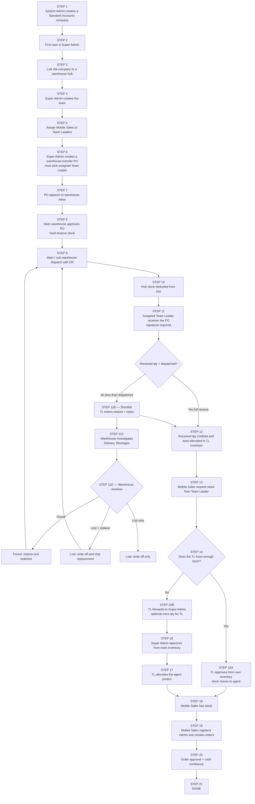
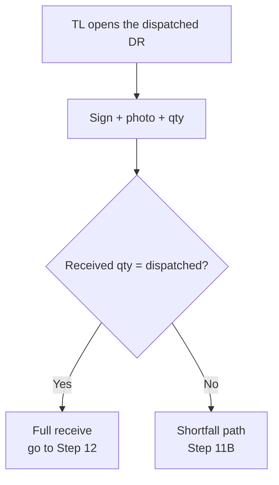
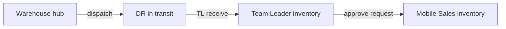
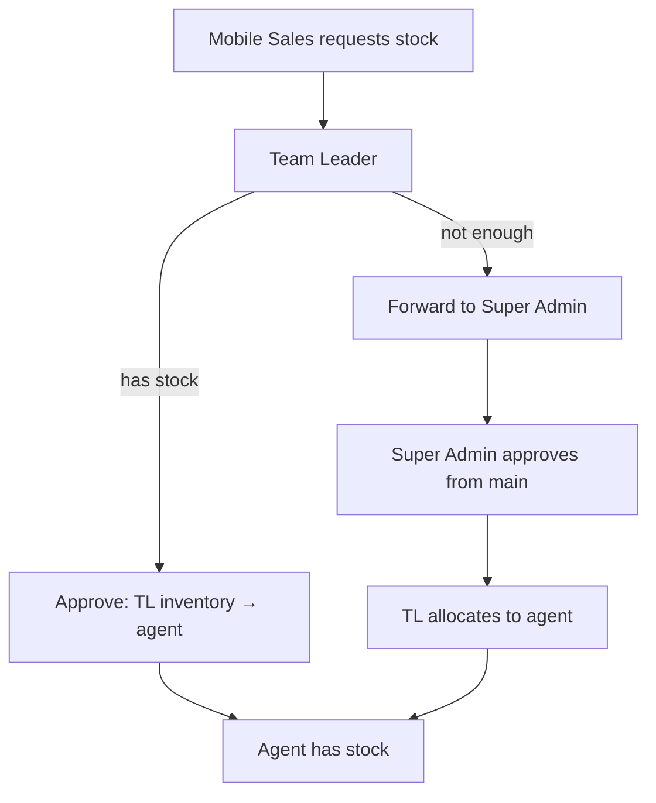
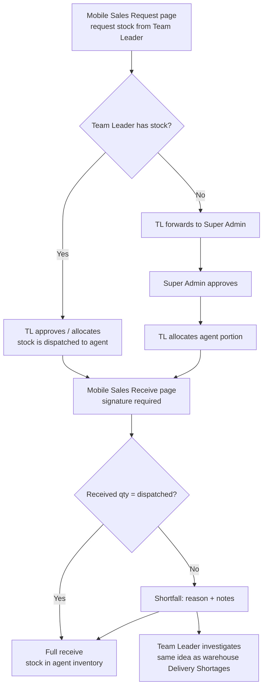

# Standard Accounts — Step by Step

Chain: **Warehouse → Super Admin → Team Leader → Mobile Sales**

Start at **Step 1**. Follow the numbered boxes in order.

This is Moto Sales / Standard Accounts. Stock comes from the warehouse hub, Super Admin pulls it in with a transfer PO, the assigned Team Leader receives it, then Mobile Sales request from the leader and sell to clients.

**Today:** Mobile Sales only **requests** stock. Stock lands in their inventory when the Team Leader approves or allocates.

**Future:** Mobile Sales will also have **Request** and **Receive** pages, same idea as Team Leader. See [Future — Mobile Sales request and receive](#future--mobile-sales-request-and-receive).

Key Accounts is a different chain. See [key-account-and-warehouse-po-flowcharts.md](./key-account-and-warehouse-po-flowcharts.md).  
Warehouse modules only (no sales roles): [warehouse-modules-flowcharts.md](./warehouse-modules-flowcharts.md).

---

## Full flowchart (first step → last step)



---

## Step 1 — Create the Standard Accounts company

**Who:** System Administrator

Set `company_account_type = Standard Accounts`.

This is the first step. Nothing else in this chain exists until this company exists.

---

## Step 2 — First login user is Super Admin

Creating that company also creates the first user as **Super Admin** (not Sales Admin).

Super Admin owns the tenant: users, teams, POs, main inventory, client approvals.

---

## Step 3 — Link warehouse hub

**Who:** System Administrator

Connect the Standard Accounts company to a warehouse company (`warehouse_company_assignments`).

After this:

- Super Admin creates **warehouse transfer POs** (not supplier POs, when hub-linked)
- Brands / variant catalog is owned by warehouse
- Super Admin **cannot** approve the transfer PO — warehouse does

---

## Step 4 — Super Admin creates the team

**Who:** Super Admin

Create:

1. Team Leaders
2. Mobile Sales
3. Admin / Finance (optional)

Also create hubs if attendance is used, and assign a hub to a Team Leader.

---

## Step 5 — Assign Mobile Sales to Team Leaders

**Who:** Super Admin / Admin

**Where:** Team Management

Link `mobile_sales` → `team_leader` (`leader_teams`).

A Mobile Sales agent cannot request stock or remit cash until they have a leader.

---

## Step 6 — Super Admin creates a warehouse transfer PO

**Who:** Super Admin / Admin

**Where:** `/purchase-orders`

Must:

1. Pick warehouse location(s) (main and/or sub)
2. Pick products and qty (warehouse catalog)
3. **Assign a Team Leader** (`assigned_team_leader_id`)

PO starts `status = pending`. Stock is soft-reserved at the hub.

Warehouse has not acted yet. Super Admin waits.

---

## Step 7 — Warehouse sees the PO

Warehouse PO inbox (Standard Accounts tab).

Warehouse did not create this PO. They fulfill Super Admin’s request.

---

## Step 8 — Main warehouse approves

**Who:** Main warehouse user only

- Checks stock per location
- Hard-reserves
- `status = approved_for_fulfillment`

Sub warehouse cannot approve. They wait, then dispatch only their location.

---

## Step 9 — Warehouse dispatch

Main and/or sub ship their lines: DR, rider, photos, warehouse signature.

---

## Step 10 — Stock leaves the hub

FIFO lots consumed. Hub on-hand deducted.

For Standard Accounts this is **not** done yet. The Team Leader still has to receive.

---

## Step 11 — Team Leader receives the PO

**Who:** The **assigned** Team Leader only

**Where:** Leader PO Receive

The PO receiver must sign. Received quantity cannot be more than dispatched quantity.

Required on every receive:

1. Package photo
2. Receiver signature
3. Qty received per item (0 up to dispatched)

Until this step, company field inventory does not get the stock.



---

## Step 11B — Shortfall on receive

If the Team Leader receives **less** than dispatched, that is a shortfall. They cannot receive more than dispatched.

For every short item they must enter:

| Field | Required |
|--------|----------|
| Shortfall reason | Yes: missing in transit, damaged, wrong item, or other |
| Other detail | Yes if reason is Other |
| Receive notes | Yes whenever any line is short |

What happens next:

1. Received qty still goes to TL inventory (Step 12)
2. Short qty does **not** go to inventory
3. System opens a warehouse ticket (`purchase_order_delivery_discrepancies`)
4. PO status on the TL list becomes **Shortfall · under investigation**
5. Warehouse is notified via **Delivery Shortages**

Stock is not put back on the hub automatically. Warehouse has to investigate.

---

## Step 11C — Warehouse investigates

**Who:** Main warehouse

**Where:** Inventory → Delivery Shortages

Warehouse sees the PO, DR, item, short qty, buyer reason, and notes.

---

## Step 11D — Warehouse resolves the shortfall

Warehouse picks one resolution:

| Resolution | Meaning |
|------------|---------|
| **Found → restore and redeliver** | Put stock back. Reopen the PO so warehouse can dispatch another DR for the missing qty. |
| **Lost → write off and ship replacement** | Confirm the loss. Do not restore that stock. Reopen the PO so warehouse can ship a replacement from remaining inventory. |
| **Lost → write off only** | Confirm the loss. Do not restore stock and do not reopen for another DR. |

After **redeliver** or **replace**, the flow returns to **Step 9** (dispatch another DR). The Team Leader then receives that new DR at Step 11.

---

## Step 12 — Stock lands with the Team Leader

On receive (full or partial):

1. **Received** qty is credited to the buyer company
2. That qty is **auto-allocated to the assigned TL** (`agent_inventory`)
3. Short qty stays out of inventory until warehouse resolves it (Step 11D)

Super Admin can also allocate extra from main later (`/inventory/allocations`).



---

## Step 13 — Mobile Sales request stock

**Who:** Mobile Sales

**Where:** Request Inventory (`/inventory/mobile-request`)

Agent requests against **the Team Leader’s inventory**, not warehouse and not Super Admin main.

---

## Step 14 / 15 — Team Leader handles the request

### Path A — TL has enough

**Step 15A:** Leader approves from own stock. Qty moves TL → agent. Go to Step 18.

### Path B — TL does not have enough

**Step 15B:** Leader **forwards** to Super Admin, and can add extra qty for themselves.

**Step 16:** Super Admin / Admin approves from **main inventory**.

**Step 17:** Leader allocates the agent portion.

Then go to Step 18.



---

## Step 18 — Mobile Sales has stock

**Today:** stock is now in `agent_inventory` as soon as the Team Leader approves or allocates. Selling can start.

**Future:** stock will sit with the Team Leader until Mobile Sales **receives** it (signature + qty), same as TL receiving from warehouse. See below.

---

## Future — Mobile Sales request and receive

Not built yet. Planned so Mobile Sales mirrors Team Leader.

| | Team Leader today | Mobile Sales today | Mobile Sales future |
|--|-------------------|--------------------|---------------------|
| **Request** | Request stock from Super Admin / main | Request from Team Leader | Keep request, same pattern as TL (own request page) |
| **Receive** | Receive warehouse DR (signature, qty, shortfall) | None. Stock is pushed in on TL approve | Receive from Team Leader (signature, qty, shortfall) |

### Future flowchart (after Step 15 / 17)



### Future receive rules (same as TL receive today)

The Mobile Sales receiver must sign. Received quantity cannot be more than what the Team Leader dispatched.

- Package photo + signature required
- Qty received per item: 0 up to dispatched
- If less than dispatched: shortfall reason + notes
- Received qty goes to `agent_inventory`
- Short qty does not; it is investigated (Team Leader / warehouse, TBD)

Until Mobile Sales receives, stock stays with the Team Leader. Selling starts only after receive.

---

## Step 19 — Clients and orders

**Who:** Mobile Sales (Team Leader can also sell)

1. Register clients (auto-approved if city matches; else Super Admin pending)
2. Create client orders from **agent inventory**
3. Payment: cash / cheque / bank / GCash / split

---

## Step 20 — Approval and remittance

**Orders**

| Payment | First stop | Then |
|---------|------------|------|
| Cash / Cheque | Team Leader (cash deposit) | Finance / Super Admin final approve |
| Bank / GCash | Finance | Super Admin / Finance final approve |

**End of day**

1. Mobile Sales remits cash proceeds to Team Leader (unsold stock stays with agent)
2. Team Leader records bank deposit
3. Finance / Super Admin can then approve those cash orders

---

## Step 21 — Done

Product path for Standard Accounts:

```
Warehouse hub
  → Super Admin transfer PO
    → Warehouse approve + dispatch
      → Team Leader receive
          → full match → TL inventory
          → shortfall → warehouse Delivery Shortages
        → Mobile Sales request
        → (future) Mobile Sales receive, same as TL
          → Client order
```

---

## Numbered list (same flow)

1. System Admin creates Standard Accounts company
2. First user is Super Admin
3. Link warehouse hub
4. Super Admin creates Team Leaders and Mobile Sales
5. Assign agents to Team Leaders
6. Super Admin creates warehouse transfer PO and assigns a TL
7. Warehouse inbox
8. Main warehouse approves and reserves
9. Dispatch with DR
10. Hub stock deducted
11. Assigned Team Leader receives the PO (signature required; received qty cannot exceed dispatched)
11B. If shortfall: TL enters reason + notes; warehouse ticket opens
11C. Warehouse investigates in Delivery Shortages
11D. Warehouse resolves: redeliver, replace, or write-off
12. Received qty auto-allocated to TL inventory
13. Mobile Sales request stock from TL
14. TL has stock? yes / no
15. TL approve from own stock **or** forward to Super Admin
16. Super Admin approves from main (if forwarded)
17. TL allocates to agent (if forwarded)
18. Mobile Sales has stock *(today: on TL approve. Future: after Mobile Sales receive page)*
18F. **Future:** Mobile Sales Request + Receive pages, same as Team Leader (signature, qty, shortfall)
19. Clients + orders
20. Order approval + cash remittance
21. Done

---

## How this differs from Key Accounts

| | Key Accounts | Standard Accounts |
|--|--------------|-------------------|
| First user | Sales Admin | Super Admin |
| Field roles | Director / KAM | Team Leader / Mobile Sales |
| Who creates the warehouse PO | KAM / Head / Director / Admin on behalf | Super Admin |
| Extra KA approvals | Owner / Director / Sales Admin / RFPF | None. PO goes straight to warehouse |
| After warehouse dispatch | Delivered. Stop | **Team Leader must receive** |
| Shortfall on receive | None (no buyer receive) | TL reports reason → warehouse Delivery Shortages |
| Who holds stock | Hub only (no buyer inventory credit) | TL inventory → agent inventory |
| Who sells | KAM against warehouse transfer | Mobile Sales from personal stock |
