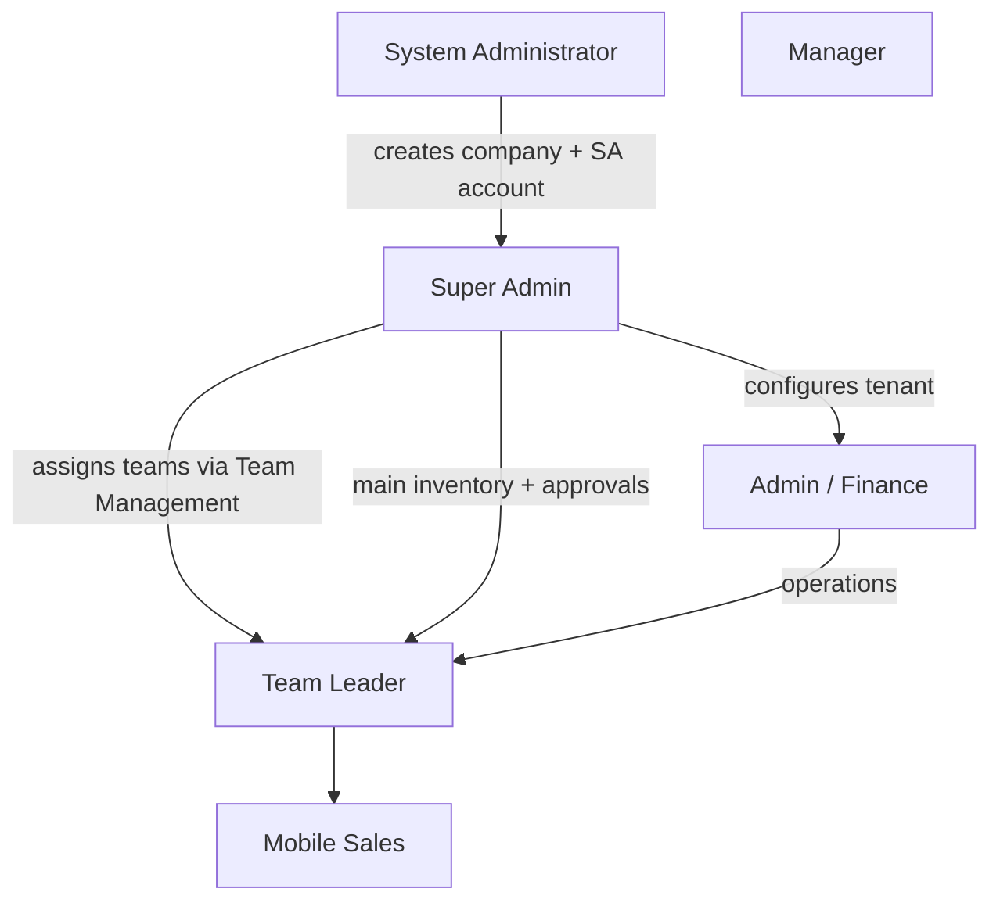
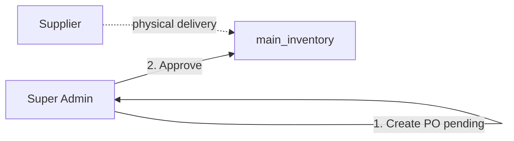
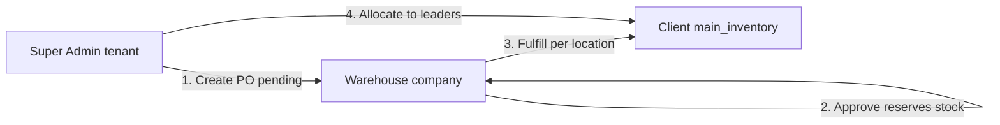

# Super Admin Role — Workflow Overview

This document describes how the **Super Admin** role (`super_admin`) works in the B1G Ordering System: tenant-level ownership, navigation, daily operations, and how it differs from **Admin**, **System Administrator**, and field roles.

For downstream flows, see [mobile-sales-workflow.md](./mobile-sales-workflow.md), [team-leader-workflow.md](./team-leader-workflow.md), and [order-correction-options.md](./order-correction-options.md).

---

## Role identity

| Item | Detail |
|------|--------|
| Database role | `super_admin` |
| Display name | Super Admin |
| Hierarchy level | 90 (`getRoleLevel` — below `system_administrator`, above `admin`) |
| Scope | **One company (tenant)** via `profiles.company_id` and RLS |
| Typical account | Company owner created when a tenant is provisioned |

**Not the same as:**

- **`system_administrator`** — platform operator; creates companies and super admin credentials on `/sys-admin-dashboard` (multi-tenant).
- **`admin`** — company operations user with nearly the same menus but fewer super-admin-only items and a different dashboard.

Legacy: super admin is the top role **inside a tenant**, not across all companies in the app (unless using system-admin impersonation).

---

## Access model

- **`ProtectedRoute`:** `super_admin` bypasses all `allowedRoles` restrictions (can open any protected route).
- **`usePermissions`:** `checkPermission` returns `true` for all routes; `checkFeature` returns `true` for all mutations.
- **Exception:** if the company is linked to a **warehouse hub** (`warehouse_company_assignments`), `/brands` and `/variant-types` are hidden (catalog owned by warehouse).
- **Profile:** only `super_admin` can change their own login email on `/profile`.

Login redirect: `/super-admin-dashboard` (`RoleBasedRedirect.tsx`, `LoginPage.tsx`).

---

## Navigation (sidebar)

From `superAdminMenuItems` in `AppSidebar.tsx`:

| Area | Routes | Purpose |
|------|--------|---------|
| Dashboard | `/super-admin-dashboard` | Company-wide KPIs (users, inventory, revenue) |
| Member Management | `/sales-agents`, `/team-management`, `/hub-management` | Users, teams, attendance hubs |
| Inventory | `/inventory/main`, `/inventory/allocations`, `/inventory/admin-requests`, `/inventory/admin-team-remittances` | Main stock, allocate to leaders, approve requests, audit remittances |
| Clients | `/clients`, `/clients/pending`, `/voided-clients` | Full client DB, approvals, voided |
| Finance | `/finance`, `/orders`, `/inventory/cash-deposits`, `/finance/payment-settings` | Revenue, order approval, deposits, payment config |
| Procurement | `/purchase-orders`, `/brands`, `/variant-types`, `/suppliers` | POs and catalog (catalog may be locked) |
| Agent Attendance | `/agent-attendance-overview` | Company-wide attendance report |
| AI Analytics | `/analytics` | Full-company analytics |
| War Room | `/war-room` | Strategic map/KPI view |
| System History | `/system-history` | Audit log |
| Settings | `/profile`, `/system-settings` | Profile + pricing permissions for roles |

**Also reachable (not always in sidebar):** `/inventory/admin-tl-requests` (with `admin`), `/member-management`, field routes if needed for support.

**Compared to `admin` menu:** super admin adds **Hub Management**, **Agent Attendance Overview**, **System Settings**, and uses **Super Admin Dashboard** instead of `/dashboard`. Admin sidebar includes **TL Stock Requests** under Inventory; super admin sidebar does not list it but can still access the route.

---

## Organization model (within one company)



Super admin responsibilities:

1. **Provision structure** — users, roles, `leader_teams`, hubs.
2. **Inbound stock (procurement)** — purchase orders from **suppliers** or **linked warehouse hub** into `main_inventory`.
3. **Supply chain** — allocate main stock to leaders, approve agent stock requests, audit remittances.
4. **Governance** — pending clients, voided clients, system settings, audit.
5. **Financial oversight** — **client** orders (`/orders`), deposits, payment settings (with finance where applicable).

---

## Typical operations — end to end

### 1. Super Admin Dashboard (`/super-admin-dashboard`)

**Page:** `SuperAdminDashboardPage.tsx`

Company-scoped metrics:

- Users (total / active), recent user list by role  
- Main inventory: stock, allocated, available  
- Revenue by year (approved + pending), monthly chart  
- Requires `user.company_id`

Use as the daily control tower for the tenant.

---

### 2. Member Management

#### User Management (`/sales-agents` or `/member-management`)

- Create users (roles: mobile sales, team leader, manager, admin, finance, etc.) via edge function / forms  
- Edit profile, region, cities, status (active/inactive)  
- Reset passwords, delete users  
- **Allocate stock** from main inventory to users (`canAllocateFromMain`)  
- Tabs may include team management on combined member page  

#### Team Management (`/team-management`)

- Assign `mobile_sales` → `team_leader` (and hierarchy under managers) via `assign_agent_to_leader` RPC  
- Admin/super_admin only for assignments  
- Sub-teams and team names  

#### Hub Management (`/hub-management`) — **super_admin only route**

- Create/edit hubs (name, map coordinates, radius) for agent attendance geofencing  
- Link hubs to team leaders (`assigned_team_leader_id`)

---

### 3. Inventory

| Step | Route | Super admin actions |
|------|--------|---------------------|
| Main warehouse | `/inventory/main` | View/adjust `main_inventory` (stock, costs) |
| Allocate to leaders | `/inventory/allocations` | Push stock to team leaders’ inventory |
| Leader/agent requests | `/inventory/admin-requests` | Approve/deny/fulfill forwarded `stock_requests` (combined leader + agent qty) |
| TL requests | `/inventory/admin-tl-requests` | Approve team-leader-to-team-leader / manager stock transfers |
| Remittance audit | `/inventory/admin-team-remittances` | Review remittance logs across teams |

**Stock flow (summary):** agents request → leader approve/forward → **super admin/admin** approve from main → leader distributes to agents. See `implement_stock_preorder_system.sql`.

---

### 4. Clients

| Route | Actions |
|--------|---------|
| `/clients` | Full company client database; transfer between agents, void, bulk operations |
| `/clients/pending` | Approve/reject registrations (e.g. outside agent cities) |
| `/voided-clients` | Review and restore voided accounts |

---

### 5. Finance & orders

| Route | Actions |
|--------|---------|
| `/finance` | Company financial dashboard |
| `/orders` | **Approve/reject** client orders (`updateOrderStatus` → `approve_order_and_verify_deposit`); import/export; bulk approve (finance-style flows where enabled) |
| `/inventory/cash-deposits` | View/verify team deposits; required before cash/cheque order approval |
| `/finance/payment-settings` | Payment configuration (`super_admin` + `finance`) |

Super admin shares finance approval powers with admin (`canApproveFinance`, `canViewAllOrders`).

**Order approval:** final `admin_approved` stage; cash/cheque blocked until team leader deposit is recorded.

---

### 6. Procurement (purchase orders) — **important**

**Purchase orders (POs)** are **not** the same as **client orders** on `/orders`.

| | Purchase orders (`/purchase-orders`) | Client orders (`/orders`) |
|---|--------------------------------------|---------------------------|
| Purpose | Buy stock **into the company warehouse** (`main_inventory`) | Sell stock **to clients** (deducts agent inventory) |
| Created by | Super admin / admin (tenant) | Mobile sales / team leaders |
| Typical approval | Super admin (supplier PO) or **warehouse role** (internal transfer) | Finance / admin after deposits |
| Feeds | Main inventory → allocations → field stock | Revenue, remittance, finance |

All PO work is under sidebar **Procurement**.

#### 6.1 Prerequisites (set up before POs)

| Route | Purpose |
|--------|---------|
| `/suppliers` | Maintain vendor records (company name, contact, active/inactive). Required for **supplier** POs. |
| `/brands` | Product brands for the tenant catalog. |
| `/variant-types` | Flavor, battery, POSM, etc. |
| `/purchase-orders` | Create and track POs |

**Warehouse hub link:** if `warehouse_company_assignments` links your tenant to a warehouse company:

- Create PO dialog defaults to **Internal warehouse transfer** mode.
- `/brands` and `/variant-types` menus are **hidden** (catalog controlled by warehouse; `usePermissions`).
- PO lines use the **warehouse catalog**; stock is validated against warehouse locations.
- Super admin **cannot** approve transfer POs on the tenant app — the **warehouse** company approves and fulfills.

#### 6.2 Purchase Orders page (`/purchase-orders`)

**Pages / code:** `PurchaseOrdersPage.tsx`, `CreatePurchaseOrderDialog.tsx`, `PurchaseOrderContext.tsx`

**Super admin can:**

- **Create PO** — button opens full-screen dialog (not available to `warehouse` role as requestor).
- **List / search** — by PO number, supplier name, type (Supplier vs Internal), warehouse location.
- **View** — line items, status, requestor company, per-location progress on multi-warehouse transfers.
- **COF** — generate/print **Confirmation of Order** PDF (`generateCofPdf.ts`) for documentation.
- **Approve / Reject** — depends on PO type (see below).
- Real-time refresh when `purchase_orders` or `purchase_order_items` change.

**PO number:** auto-generated `PO-{YEAR}-{SEQUENCE}` (e.g. `PO-2026-1001`) per company.

**On create (both types):**

- Order date, expected delivery date, tax rate, discount, notes.
- Line items: variant, quantity, unit price.
- Status set to **`pending`**.
- `created_by` = current user; `company_id` = tenant.

**Create dialog — optional inline catalog:**

- New brands/variants can be created during PO entry (under tenant or warehouse catalog company).
- **Warehouse transfer:** validates **available stock** at selected warehouse location before submit; rejects insufficient qty.
- **Single-source transfer:** one sub-warehouse/main location for all lines.
- **Multi-source transfer:** each line picks its own warehouse location.

#### 6.3 Path A — Supplier purchase order

`fulfillment_type: **supplier**`

Use when buying from an external vendor (supplier selected from `/suppliers`).



| Step | Who | What happens |
|------|-----|----------------|
| 1. Create | Super admin / admin | PO + line items → `status: pending` |
| 2. Approve | Super admin / admin on `/purchase-orders` | Button **Approve** (tenant users; `canApproveOrder` true for supplier POs) |
| 3. Database | RPC `approve_purchase_order` | `status → approved`; quantities **added to `main_inventory`**; `inventory_transactions` audit rows |
| 4. Reject | Super admin / admin | `status → rejected` while pending (label **Cancel** if you created the PO) |

**After approval:** stock is in **main inventory**. Next steps for super admin:

1. `/inventory/allocations` — allocate to team leaders.  
2. `/inventory/admin-requests` — fulfill leader-forwarded agent requests.  
3. Field teams distribute to mobile sales (see [team-leader-workflow.md](./team-leader-workflow.md)).

**Note:** Supplier PO approval is immediate receipt into main inventory (no separate “fulfill” step on tenant side).

#### 6.4 Path B — Internal warehouse transfer PO

`fulfillment_type: **warehouse_transfer**`

Use when the tenant is linked to a **warehouse hub** and stock should move from the warehouse company into the **tenant’s** `main_inventory`.



| Step | Who | What happens |
|------|-----|----------------|
| 1. Create | Super admin / admin | PO references `warehouse_company_id`, line-level `warehouse_location_id`(s); stock checked at source; `pending` |
| 2. Approve | **Warehouse** user (main warehouse) | On warehouse’s `/purchase-orders` inbox — **not** super admin tenant UI (`canApproveOrder` false for transfer on tenant) |
| 2b. RPC | `approve_multi_location_po` (or legacy single-location approve) | Validates stock at each location; creates **reservations**; location status → `ready`; PO → **`approved_for_fulfillment`** |
| 3. Fulfill | Warehouse user (main or sub location) | RPC `fulfill_po_location` per location; deducts warehouse stock; adds to **client `main_inventory`**; may create **`warehouse_variant_mappings`**; writes `inventory_transactions` (`warehouse_transfer_in`) |
| 4. PO status | System | `partially_fulfilled` until all locations done, then **`fulfilled`** |
| 5. Tenant ops | Super admin | Allocate / approve agent requests from new main stock |

**Super admin on tenant `/purchase-orders` for transfers:**

- Can **create** and **view** transfer POs.
- Typically **cannot** Approve or Fulfill (those actions are for `warehouse` role with matching `company_id` / location membership).
- Waits for warehouse to complete approval and fulfillment.

**Multi-location transfers:** view dialog shows **per-location status** (`warehouse_transfer_location_status`: e.g. `ready`, `fulfilled`). Each sub-warehouse/main location fulfills its slice independently.

#### 6.5 PO status reference

| Status | Meaning (typical) |
|--------|-------------------|
| `pending` | Awaiting approval (supplier: tenant; transfer: warehouse) |
| `approved` | Supplier PO approved; stock in main inventory |
| `approved_for_fulfillment` | Warehouse transfer approved; stock reserved; awaiting fulfillment |
| `partially_fulfilled` | Transfer PO: some warehouse locations fulfilled, not all |
| `fulfilled` | Transfer PO: all locations fulfilled; client main inventory updated |
| `rejected` | Denied while pending |
| `draft` / `submitted` / `cancelled` / `delivered` | Legacy or edge labels in types — UI primarily uses rows above |

#### 6.6 How procurement connects to the rest of the tenant

```text
[Procurement]
  Supplier PO approve ──────────────┐
  Warehouse transfer fulfill ───────┤
                                    ▼
                            main_inventory (/inventory/main)
                                    │
                    ┌───────────────┴───────────────┐
                    ▼                               ▼
        stock_allocations (/inventory/allocations)   admin_requests (/inventory/admin-requests)
        → team leader inventory                      → leader forwards agent requests
                    │                               → admin approves from main
                    ▼                               ▼
        leader → mobile_sales agent_inventory
                    │
                    ▼
              client_orders (/orders) — separate sales flow
```

**Admin-only sidebar item:** `/inventory/admin-tl-requests` — team-leader stock transfers between leaders (not the same as PO, but related inventory governance). Super admin can open this route even if not listed in the super admin submenu.

---

### 7. Agent Attendance Overview (`/agent-attendance-overview`)

- Company-wide attendance for `mobile_sales`  
- Filter/export; tenant admin view (`super_admin` or `admin`)  
- Complements per-leader `/team-attendances`

---

### 8. Analytics & War Room

- **`/analytics`:** full company data (not team-scoped like team leader)  
- **`/war-room`:** geographic/strategic KPI view for executives and admins  

---

### 9. System History (`/system-history`)

- Audit trail for important changes  
- Visible to super admin, admin, system administrator (per page logic)

---

### 10. System Settings (`/system-settings`)

**Super-admin-facing tenant config:**

- `team_leader_allowed_pricing` — which price columns leaders may use on orders  
- `mobile_sales_allowed_pricing` — same for mobile sales  
- Saved on `companies` table  

Admin users typically use `/profile` only; pricing config is under super admin **Settings** menu.

---

## Permissions vs other roles

| Capability | Super Admin | Admin | System Admin |
|------------|:-----------:|:-----:|:------------:|
| Tenant scope | One company | One company | All companies |
| Bypass route guards | Yes | No | No (own routes) |
| Super admin dashboard | Yes | No | No |
| Hub management | Yes | No* | No |
| System settings (pricing) | Yes | No** | N/A |
| Team assignment RPC | Yes | Yes | No |
| Approve orders / main stock | Yes | Yes | No |
| Field sales / remit | No | No | No |
| Create new companies | No | No | Yes |

\* Hub route is `allowedRoles: ['super_admin']` only.  
\*\* Admin may reach `/system-settings` by URL but it is not in the admin sidebar.

---

## Happy path checklist (tenant setup & run)

1. **Account exists** — created with company by system administrator.  
2. **System settings** — set mobile sales / team leader pricing options.  
3. **Procurement setup** — suppliers; brands/variant types (if not warehouse-linked).  
4. **Receive stock into main inventory:**  
   - **Supplier PO:** create on `/purchase-orders` → approve as super admin; or  
   - **Warehouse transfer:** create transfer PO → warehouse hub approves → warehouse fulfills.  
5. **Users** — create managers, team leaders, mobile sales.  
6. **Teams** — assign agents to leaders; configure hubs.  
7. **Allocate stock** — `/inventory/allocations` to leaders; approve `/inventory/admin-requests` for agents.  
8. **Field operations** — clients, tasks, mobile sales orders, remittances.  
9. **Finance** — cash deposits recorded; **client** orders approved on `/orders`.  
10. **Review** — analytics, war room, system history.

---

## Code reference index

| Area | Primary files |
|------|----------------|
| Sidebar / access | `AppSidebar.tsx`, `ProtectedRoute.tsx`, `usePermissions.ts` |
| Dashboard | `superadmin/SuperAdminDashboardPage.tsx` |
| Users / teams | `SalesAgentsPage.tsx`, `TeamManagementTab.tsx`, `TeamManagementPage.tsx` |
| Hubs | `HubManagementPage` (route in `App.tsx`) |
| Inventory | `MainInventoryPage.tsx`, `StockAllocationsPage.tsx`, `AdminRequestsPage.tsx`, `AdminTLRequestsPage.tsx`, `AdminTeamRemittancesPage.tsx` |
| Clients | `ClientsPage.tsx`, `PendingClientsPage.tsx`, `VoidedClientsPage.tsx` |
| **Purchase orders** | `PurchaseOrdersPage.tsx`, `CreatePurchaseOrderDialog.tsx`, `PurchaseOrderContext.tsx`, `cof/generateCofPdf.ts` |
| **Suppliers / catalog** | `SuppliersPage.tsx`, `BrandsPage.tsx`, `VariantTypesPage.tsx` |
| PO RPCs (DB) | `approve_purchase_order`, `approve_multi_location_po`, `fulfill_po_location` |
| Client orders / finance | `OrdersPage.tsx`, `FinancePage.tsx`, `LeaderCashDepositsPage.tsx`, `PaymentSettingsPage.tsx` |
| Settings | `SystemSettingsPage.tsx` |
| Attendance | `AgentAttendanceOverviewPage.tsx` |
| Role helpers | `roleUtils.ts`, `roleMenuHelper.ts` |

---

## Known gaps / notes

- Data is **company-scoped**; super admin does not automatically see other tenants (system administrator does).  
- Warehouse hub link disables local brand/variant management.  
- Sidebar omits **TL Stock Requests** though route allows `admin` and `super_admin`.  
- **Transfer POs** must be approved/fulfilled by **warehouse** users, not tenant super admin.  
- Order reject inventory restore (client orders): [order-correction-options.md](./order-correction-options.md).  
- **Impersonation / Live View** in the UI is tied to `impersonatedCompany` in auth context (used when a system admin views a tenant), not the normal super admin daily login.
