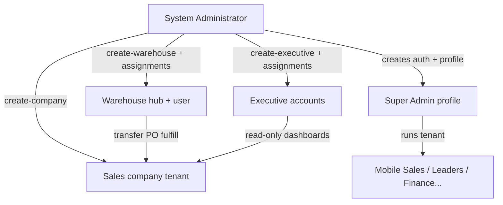

# System Administrator Role — Workflow Overview

This document describes how the **System Administrator** role (`system_administrator`) works in the B1G Ordering System: multi-tenant provisioning, executive and warehouse account management, cross-company observability, and **Live View** impersonation.

For tenant-level operations after a company exists, see [super-admin-workflow.md](./super-admin-workflow.md). For warehouse and executive behavior after provisioning, see [warehouse-workflow.md](./warehouse-workflow.md) and executive routes (`/executive-dashboard`, `/war-room`).

---

## Role identity


| Item                   | Detail                                                    |
| ---------------------- | --------------------------------------------------------- |
| Database role          | `system_administrator`                                    |
| Display name           | System Administrator                                      |
| Hierarchy level        | 100 (`getRoleLevel` — highest in app)                     |
| Scope                  | **Platform** (all tenants); not tied to one sales company |
| `profiles.company_id`  | Typically **null** (no tenant RLS scope)                  |
| Has personal inventory | No                                                        |
| Can lead a team        | No                                                        |


The system administrator **creates and governs tenants** (sales companies + their super admin login). They do **not** run day-to-day sales, inventory, or finance inside a tenant except via **read-only Live View** or **Management Portal** snapshots.

**Not the same as:**

- `**super_admin`** — owner **inside one company**; full tenant ops.
- `**executive`** — read-only strategic user assigned to **one or more companies** (created by system admin).
- `**warehouse`** — hub distribution user (created by system admin on `/system-admin`).

**Provisioning:** initial system administrator account is created outside the app (database / auth bootstrap). Additional platform users would follow the same pattern.

---

## Access model

- **Login redirect:** `/sys-admin-dashboard` (`RoleBasedRedirect.tsx`, `LoginPage.tsx`).
- **Sidebar:** `systemAdminMenuItems` in `AppSidebar.tsx`.
- **Route whitelist** (`usePermissions.ts`) when **not** impersonating:
  - `/sys-admin-dashboard`
  - `/system-admin`
  - `/system-management`
  - `/profile`
  - Routes starting with `/sys-admin`
- **No tenant operations menu** — no `/orders`, `/clients`, `/inventory/main`, etc. in normal mode.
- **Database RLS:** `is_system_administrator()` grants **SELECT** across companies for many tables (orders, clients, inventory, audit logs, etc.) for support and portal queries.
- **Edge functions:** `create-company`, `create-executive`, `create-warehouse` verify caller role is `system_administrator` (service role on server).

**Live View (impersonation):**

- From **Management Portal** → **Live View** calls `startImpersonation(company)`.
- Effective user becomes `super_admin` with `company_id` = selected tenant (`AuthContext.tsx`).
- Sidebar switches to **super admin menu**; `document.body` gets `read-only-mode` (mutations disabled via CSS + `checkFeature` false).
- Exit via sidebar **Stop Live View** → `stopImpersonation()`.

---

## Navigation (sidebar)


| Screen            | Route                  | Purpose                                                                 |
| ----------------- | ---------------------- | ----------------------------------------------------------------------- |
| Dashboard         | `/sys-admin-dashboard` | Create/list/manage **sales tenants** (companies)                        |
| Executive Account | `/system-admin`        | Create/manage **executive** and **warehouse** accounts                  |
| Management Portal | `/system-management`   | Cross-tenant read-only drill-down (clients, inventory, orders, finance) |
| System History    | `/system-history`      | Platform-wide audit trail (see access note below)                       |
| Profile           | `/profile`             | System administrator profile                                            |


> **Note:** `/system-history` appears in the sidebar but `usePermissions` may **hide** it from the filtered menu because it is not in the system-admin route whitelist. The page can still load if navigated directly (`ProtectedRoute` does not block by role). Consider adding `/system-history` to the whitelist if the menu item should work consistently.

---

## Organization model (platform)




**Hidden platform company:** lists exclude `SYSTEM_ADMIN_COMPANY_ID` (`6a3da573-af53-4def-a665-0f1782c70097`) — internal “System Administration” row, not a customer tenant.

---

## Typical operations — end to end

### 1. System Administration Dashboard (`/sys-admin-dashboard`)

**Page:** `SysAdDashboardPage.tsx`

**Company list**

- All `companies` except the hidden system-admin company.
- Columns: name, email, super admin contact, status, account type, created date.

**Create company (Add Company)**

Calls edge function `**create-company`** with:


| Field                  | Purpose                               |
| ---------------------- | ------------------------------------- |
| `company_name`         | Tenant display name                   |
| `company_email`        | Company contact email                 |
| `super_admin_name`     | First super admin full name           |
| `super_admin_email`    | Login email                           |
| `super_admin_password` | Initial password (min 6 chars)        |
| `company_account_type` | `Standard Accounts` or `Key Accounts` |


**Server actions (`create-company`):**

1. Insert `companies` row (`status: active`, `role: Super Admin` metadata on company).
2. `auth.admin.createUser` for super admin.
3. Insert `profiles` with `role: super_admin`, `company_id` = new company.

**Company actions (dropdown)**


| Action       | Behavior                                                                                                                     |
| ------------ | ---------------------------------------------------------------------------------------------------------------------------- |
| View details | Dialog with company + super admin info                                                                                       |
| Inactivate   | `companies.status` → `inactive`; tenant users get realtime logout (`AuthContext` company subscription)                       |
| Delete       | RPC `**delete_company_cascade(p_company_id)`** — removes company and related data (assignments, users linkage per migration) |


After create, the **super admin** logs in and runs the tenant (users, inventory, orders) per [super-admin-workflow.md](./super-admin-workflow.md).

---

### 2. Executive Account (`/system-admin`)

**Page:** `SystemAdminPage.tsx` — tabs:

#### Executive accounts (`ExecutiveAccountsTab.tsx`)

- Lists `profiles` where `role = executive`.
- **Create executive** → edge function `**create-executive`** (system administrator only):
  - Auth user + profile (`company_id` null).
  - Optional `**executive_company_assignments**` for one or more tenant companies.
- **Edit** — update profile and company assignments.
- Executives use `**/executive-dashboard`** and `**/war-room**` (read-only analytics across assigned companies).

#### Warehouse accounts (`WarehouseAccountsTab.tsx`)

- Lists `profiles` where `role = warehouse`.
- **Create warehouse** → edge function `**create-warehouse`**:
  - New **warehouse company** (hub inventory company).
  - Warehouse user profile linked to that company.
  - `**warehouse_company_assignments`** — link hub user to one or more **client** tenant companies (at least one required).
- **Edit** — update user, assignments, inventory company label.

After create, warehouse users operate per [warehouse-workflow.md](./warehouse-workflow.md) (catalog, transfer PO approve/fulfill).

---

### 3. Management Portal (`/system-management`)

**Page:** `ManagementPortal.tsx`  
**Access:** `user.role === 'system_administrator'` only.

**Company grid**

- Search/filter tenants.
- Select a company → tabbed **read-only** operational views:


| Tab       | Component         | Data                                 |
| --------- | ----------------- | ------------------------------------ |
| Clients   | `PortalClients`   | `clients` for `companyId`            |
| Inventory | `PortalInventory` | Main/agent inventory snapshot        |
| Orders    | `PortalOrders`    | `client_orders` for tenant           |
| Finance   | `PortalFinance`   | Financial/deposit summary for tenant |


**Live View**

- Opens tenant as **impersonated super admin** (read-only).
- Navigates to `/dashboard` with full super-admin sidebar; no write actions.

Use the portal for **support and audits** without mutating tenant data.

---

### 4. System History (`/system-history`)

**Page:** `SystemHistoryPage.tsx`

- Title: **System History** / comprehensive audit trail.
- Table filters include clients, orders, inventory, companies, remittances, POs, etc. (same filter set as super admin).
- RLS policies: `system_administrator_all_audit` on `system_audit_log` (and business audit).

Platform-wide visibility; not limited to one `company_id` on the profile.

---

### 5. Profile (`/profile`)

Standard profile for the system administrator account (not tenant-scoped).

---

## How system administrator fits the full ecosystem

```text
[System Administrator]
  |
  +-- create-company --------> Sales tenant + Super Admin login
  |                              |
  |                              v
  |                         [Super Admin / Admin / Finance / Leaders / Agents]
  |
  +-- create-executive ------> Executive + company assignments -> War Room
  |
  +-- create-warehouse ------> Hub company + warehouse user + client links
  |                              |
  |                              v
  |                         [Warehouse fulfill transfer POs -> tenant main_inventory]
  |
  +-- Management Portal -----> Read-only per-tenant tabs
  |
  +-- Live View -------------> Impersonate tenant (read-only super_admin UX)
```

Downstream docs:

- Field sales: [mobile-sales-workflow.md](./mobile-sales-workflow.md)
- Leaders: [team-leader-workflow.md](./team-leader-workflow.md)
- Finance: [finance-workflow.md](./finance-workflow.md)
- Super admin tenant ops: [super-admin-workflow.md](./super-admin-workflow.md)

---

## Permissions vs other roles


| Capability                | System Administrator  | Super Admin | Executive               | Warehouse            |
| ------------------------- | --------------------- | ----------- | ----------------------- | -------------------- |
| Scope                     | All tenants           | One tenant  | Assigned tenants (read) | Hub + linked clients |
| Create sales company      | Yes                   | No          | No                      | No                   |
| Delete/inactivate company | Yes                   | No          | No                      | No                   |
| Create executive          | Yes                   | No          | No                      | No                   |
| Create warehouse hub      | Yes                   | No          | No                      | No                   |
| Tenant daily ops          | Live View only (read) | Yes         | Read dashboards         | Hub ops              |
| Approve client orders     | No*                   | Yes         | No                      | No                   |
| `company_id` on profile   | null                  | tenant id   | null                    | hub id               |


Unless using Live View UI buttons — mutations are blocked in impersonation mode.

---

## Happy path checklist (platform operator)

1. **Dashboard** — review active tenants; create new company + super admin credentials.
2. **Executive Account** — create executives and assign companies (if using War Room).
3. **Executive Account** — create warehouse hubs and link to client tenants (if using centralized catalog/stock).
4. **Management Portal** — spot-check tenant health (clients, stock, orders, finance).
5. **Live View** — reproduce a tenant issue read-only.
6. **Inactivate or delete** — offboard tenant when contract ends (`delete_company_cascade` is destructive).
7. **System History** — investigate cross-tenant audit events.

---

## Code reference index


| Area                     | Primary files                                                                 |
| ------------------------ | ----------------------------------------------------------------------------- |
| Sidebar / redirect       | `AppSidebar.tsx`, `RoleBasedRedirect.tsx`, `usePermissions.ts`                |
| Company CRUD UI          | `SysAdDashboardPage.tsx`                                                      |
| Executive / warehouse UI | `SystemAdminPage.tsx`, `ExecutiveAccountsTab.tsx`, `WarehouseAccountsTab.tsx` |
| Management portal        | `ManagementPortal.tsx`, `portal/Portal*.tsx`                                  |
| Impersonation            | `AuthContext.tsx` (`startImpersonation`, `effectiveUser`, `read-only-mode`)   |
| Edge functions           | `supabase/functions/create-company`, `create-executive`, `create-warehouse`   |
| Delete tenant            | `delete_company_cascade` RPC                                                  |
| RLS helper               | `is_system_administrator()`                                                   |
| Audit                    | `SystemHistoryPage.tsx`, `system_administrator_all_audit` policy              |
| Constants                | `SYSTEM_ADMIN_COMPANY_ID` in portal/dashboard pages                           |


---

## Known gaps / notes

- **Route whitelist** omits `/system-history` while sidebar lists it — menu filtering may hide the link; direct URL may still work.  
- `**roleMenuHelper.ts*`* system admin menu omits **Executive Account** (`/system-admin`) present in `AppSidebar.tsx` — use App sidebar as source of truth.  
- **Live View** is read-only (CSS + `checkFeature`); system admin cannot approve orders or edit inventory through impersonation without changing that design.  
- **create-company** uses service role; only callable with valid system administrator session token.  
- **Company inactivation** forces logout for users with that `company_id` via realtime listener.  
- System administrator is **not** a substitute for tenant **super admin** for ongoing configuration (teams, pricing, POs, allocations).

