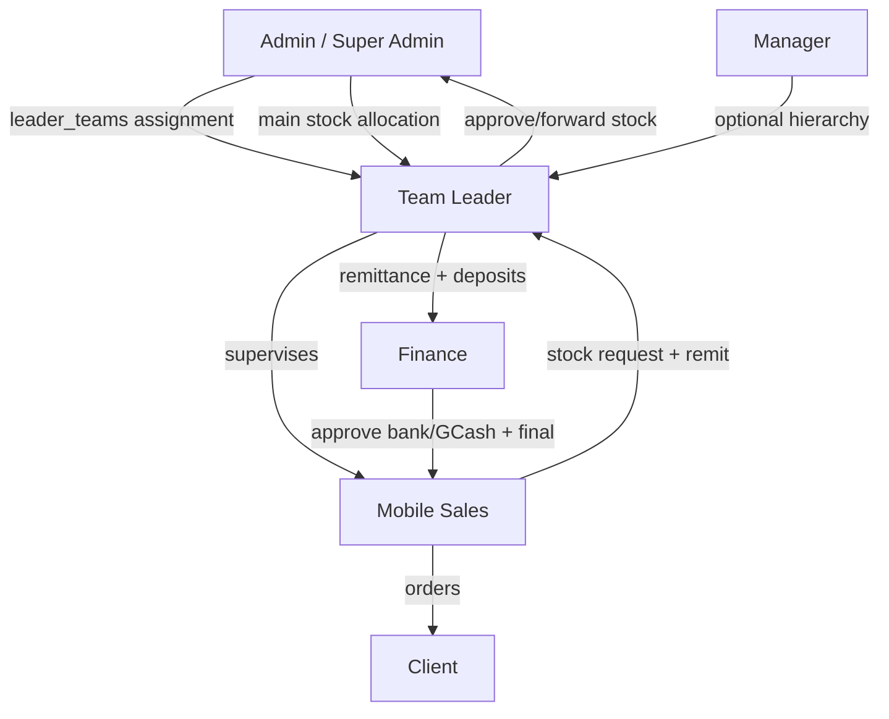

# Team Leader Role — Workflow Overview

This document describes how the **Team Leader** role (`team_leader`) works in the B1G Ordering System: navigation, daily operations, team supervision, inventory, orders, remittances, and integrations with mobile sales, admin, and finance.

For related behavior, see [mobile-sales-workflow.md](./mobile-sales-workflow.md) and [order-correction-options.md](./order-correction-options.md).

---

## Role identity

| Item | Detail |
|------|--------|
| Database role | `team_leader` |
| Display name | Team Leader |
| Hierarchy level | 50 (above `mobile_sales`, below `manager`) |
| Has personal inventory | Yes (`hasInventory('team_leader')`) |
| Can lead a team | Yes (`canLeadTeam`) |
| Reports to | Manager and/or Admin (via `leader_teams` hierarchy) |

Team leaders supervise **mobile sales** agents in `leader_teams` (`agent_id` → `leader_id`). **Admins** assign agents in Team Management; leaders typically **view** the roster on My Team, not assign it.

---

## Navigation (sidebar)

From `leaderMenuItems` in `AppSidebar.tsx`:

| Screen | Route | Purpose |
|--------|--------|---------|
| Dashboard | `/dashboard` | Team KPIs and pending actions |
| My Team | `/my-team` | Assigned mobile sales agents |
| Analytics | `/analytics` | Team performance |
| My Inventory | `/my-inventory` | Leader’s own stock |
| Request Stock | `/leader-inventory/request` | Request from admin/main |
| Teams Inventory | `/leader-inventory` | Team + leader stock |
| Pending Requests | `/inventory/pending-requests` | Agent stock requests |
| Team Remittances | `/inventory/team-remittances` | Agent EOD remittances |
| Cash Deposits | `/inventory/cash-deposits` | Bank deposits for cash/cheque orders |
| Today’s Tasks | `/tasks` | Assign/monitor tasks |
| Archive Tasks | `/tasks/archive` | Historical tasks |
| My Clients | `/my-clients` | Leader’s clients |
| My Team’s Clients | `/my-teams` | Team agents’ clients |
| My Team’s Attendance | `/team-attendances` | Agent attendance (read-only) |
| My Orders | `/my-orders` | Leader-created orders |
| Order Management | `/leader-orders` | Monitor team orders |
| Team Activity | `/system-history` | Team audit log |
| Calendar | `/calendar` | Team task calendar |
| Profile | `/profile` | Account |

**Extra route:** `/inventory/tl-stock-requests` (TL-to-TL stock; `team_leader` only).

**Not available:** admin client DB, finance `/orders` bulk approve, main inventory admin, war room, team assignment UI (admin).

---

## Organization model

---

## Typical day — end to end

### 1. Dashboard (`/dashboard`)

`useLeaderStats` shows team members, orders, clients, revenue (today/week), **pending stock requests**, **recent remittances**, and pending order counts. Use this to prioritize stock approvals, remittance review, and deposits.

### 2. My Team (`/my-team`)

Roster from `leader_teams` with per-agent sales/orders and assigned hubs. **Assignment changes are admin-only** (Team Management).

### 3. My Team’s Attendance (`/team-attendances`)

Read-only `agent_attendances` for assigned agents. Agents check in via `/attendance`.

### 4. Tasks (`/tasks`, `/tasks/archive`)

Leaders **create** tasks for team members (priority, due date/time, client, notes). Calendar shows team tasks by agent color. Only **mobile sales** mark their tasks completed on the calendar.

### 5. Clients

- **My Clients:** leader portfolio; new clients **auto-approved**; can delete.
- **My Team’s Clients:** all clients owned by team `agent_id`s; filter by agent/city.

### 6. Inventory

| Step | Route | Actions |
|------|--------|---------|
| Request own stock | `/leader-inventory/request` | Request from main; auto `approved_by_leader` for admin |
| Agent requests | `/inventory/pending-requests` | Approve (allocate from leader stock), **forward** (+ optional leader qty) to admin, or deny |
| Distribute | Same / `/leader-inventory` | Allocate fulfilled stock to agents |
| Team stock view | `/leader-inventory` | View team `agent_inventory`, manual allocate, return to main, incoming TL requests, approve agent returns |
| Personal | `/my-inventory` | Leader stock, optional EOD remit, return to main |

**RPCs:** `approve_stock_request_by_leader`, `forward_stock_request_with_leader_qty`, `reject_stock_request` (see `PendingRequestsPage.tsx`).

### 7. Orders

- **My Orders:** leader can sell; `team_leader_allowed_pricing`; cash/cheque orders auto-create `cash_deposits`.
- **Order Management (`/leader-orders`):** **view/monitor** team + own orders; **no finance final approve** (admin/finance on `/orders`).
- **Cash path:** agent `agent_pending` → agent remits → leader **Cash Deposits** → finance approves when `deposit_id` + bank details exist.

### 8. Cash Deposits (`/inventory/cash-deposits`)

Record deposits (slip, bank, reference) for team cash/cheque orders. Required before finance can approve those orders.

### 9. Team Remittances (`/inventory/team-remittances`)

Review and process agent end-of-day remittances (`remittances_log`): cash proceeds, signatures, unsold stock confirmation.

### 10. Analytics (`/analytics`)

Team-scoped KPIs (agents under `leader_teams`).

---

## Stock request flow (summary)

1. **Mobile sales** requests → leader **Pending Requests**.
2. Leader **approves** (deducts leader inventory → agent) **or forwards** (+ optional leader quantity) → **admin** approves/fulfills → leader **allocates** agent portion.
3. Leader **own** requests → `/leader-inventory/request` → admin.

See `supabase/migrations/implement_stock_preorder_system.sql`.

---

## Permissions vs mobile sales

| Capability | Team Leader | Mobile Sales |
|------------|:-----------:|:------------:|
| View team data | Yes | Own only |
| Assign agents | No (admin) | — |
| Auto-approve own clients | Always | City match |
| Delete clients | Yes | No |
| Assign tasks | Yes | No |
| Stock approve/forward | Yes | No |
| Receive remittance | Yes | Submit only |
| Cash deposits | Yes | No |
| Team attendance | Read | Own |
| `/leader-orders` | Monitor | — |
| Finance approve | No | No |
| Return to main | Yes | Return to leader |

---

## Happy path checklist

1. Dashboard — pending stock + remittances.  
2. Attendance + tasks for the day.  
3. Process **Pending Requests** (approve / forward / deny).  
4. Allocate stock after admin fulfillment.  
5. Monitor team clients and orders.  
6. **Team Remittances** + **Cash Deposits** as agents close out.  
7. Request leader stock from admin if low.  
8. Analytics review.

---

## Code reference index

| Area | Files |
|------|--------|
| Sidebar | `AppSidebar.tsx`, `App.tsx` |
| Dashboard | `DashboardPage.tsx`, `dashboardHooks.ts` |
| Team | `MyTeamPage.tsx`, `MyTeamsPage.tsx` |
| Attendance | `team-attendances/` |
| Tasks / calendar | `TasksPage.tsx`, `CalendarPage.tsx` |
| Stock | `PendingRequestsPage.tsx`, `LeaderInventoryPage.tsx`, `LeaderStockRequestPage.tsx` |
| Remit / deposits | `LeaderRemittancePage.tsx`, `LeaderCashDepositsPage.tsx` |
| Orders | `OrdersPage.tsx` (`/leader-orders`), `MyOrdersPage.tsx`, `OrderContext.tsx` |

---

## Known gaps / notes

- Roster assignment is **admin-only** on My Team (view-only roster).
- `leader-orders` does not grant finance approve; cash orders need deposits first.
- Order reject inventory restore: [order-correction-options.md](./order-correction-options.md).
