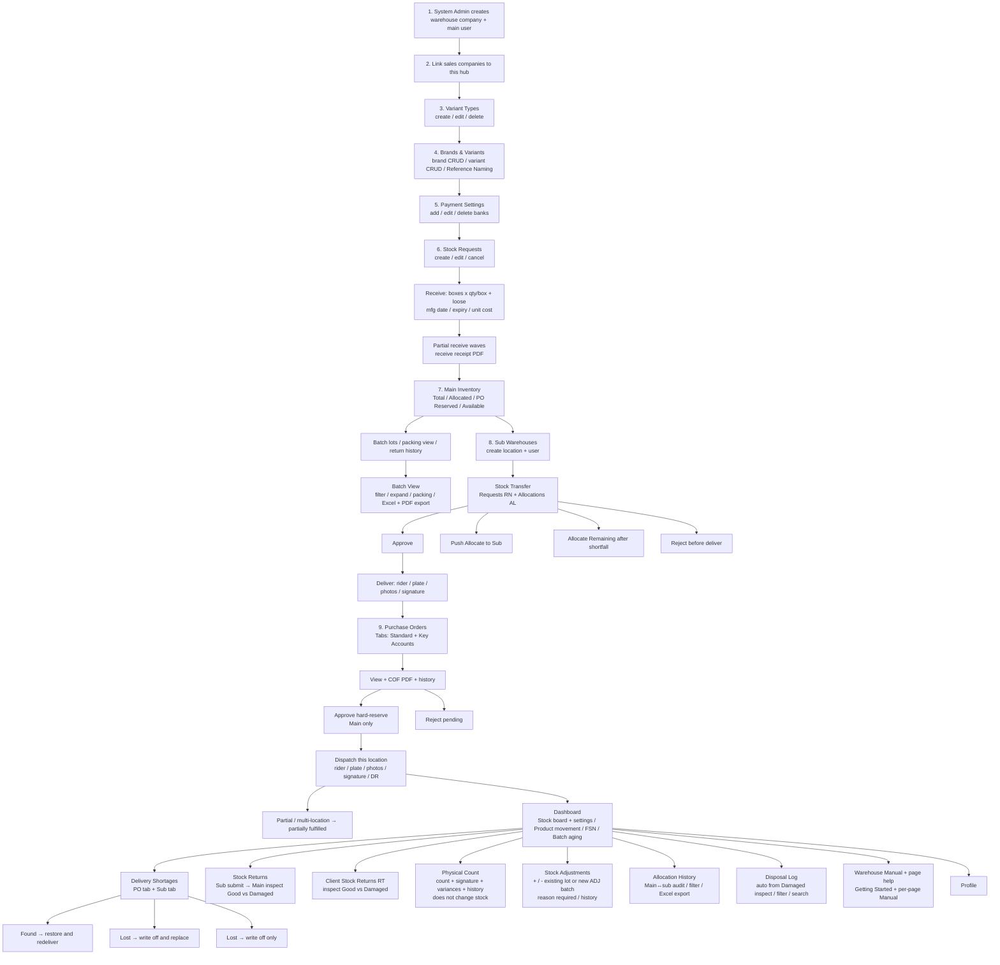
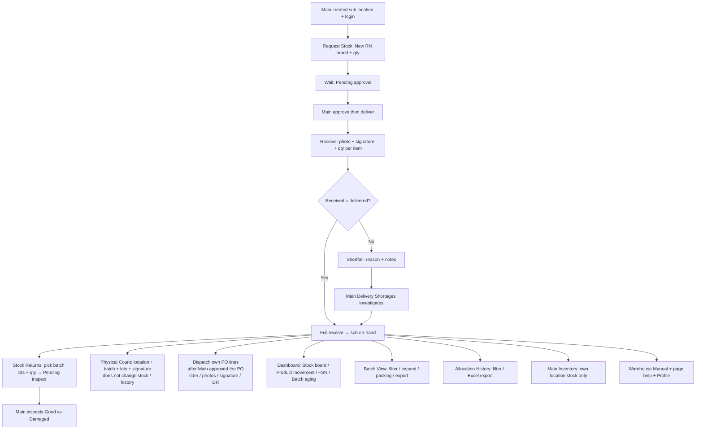
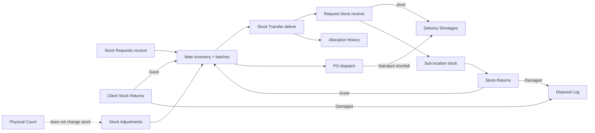
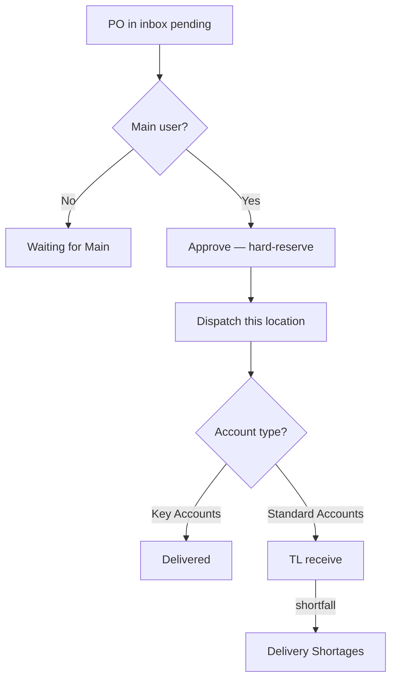

# Warehouse — All features

Warehouse hub only. Every warehouse module and in-page feature is listed here.

Sales tenants *send* work in (transfer POs, client returns). Warehouse *does* the work in these modules.

Key Accounts PO path: [key-account-and-warehouse-po-flowcharts.md](./key-account-and-warehouse-po-flowcharts.md)  
Standard Accounts PO path: [standard-account-warehouse-po-flowcharts.md](./standard-account-warehouse-po-flowcharts.md)

---

## Two warehouse users

| | Main warehouse | Sub warehouse |
|--|----------------|---------------|
| Login | Main location (`is_main`) | One sub location |
| Catalog, inbound stock, PO approve, payment banks | Yes | No |
| Create sub-warehouses | Yes | No |
| Approve / deliver to sub | Yes | Request + receive only |
| Fulfill PO lines | Own location (main lines) | Own location only |
| Typical home | `/inventory/board` | Same, scoped to their location |
| Help | Getting Started + per-page Manual + `/warehouse-manual` | Same |

---

## Complete feature map

| Module | Route | Who | Features |
|--------|-------|-----|----------|
| Dashboard | `/inventory/board` | Both | Stock board, Product movement, FSN, Batch aging, board settings, search, location chips |
| Variant Types | `/variant-types` | Main | Create / edit / delete types |
| Brands & Variants | `/brands` | Main | Brand CRUD, variant CRUD, Reference Naming catalog |
| Payment Settings | `/finance/payment-settings` | Main | Add / edit / delete bank accounts |
| Purchase Orders | `/purchase-orders` | Both | Inbox, view, COF, approve (main), reject (main), dispatch per location, DR, history, KA vs Standard tabs |
| Stock Requests | `/inventory/stock-requests` | Main | Create, edit, cancel, receive, partial receive, packing, receive receipt PDF |
| Sub Stock Requests / Stock Transfer | `/inventory/sub-stock-requests` | Main | Requests tab, Allocations tab, approve, deliver, reject, Allocate Remaining, push allocate |
| Request Stock | `/inventory/request-stock` | Sub | Create RN, receive, shortfall reason, signature |
| Stock Returns | `/inventory/stock-returns` | Both | Sub submit; Main inspect Good/Damaged; cancel |
| Client Stock Returns | `/inventory/client-stock-returns` | Main | Inspect RT-… Good/Damaged |
| Stock Adjustments | `/inventory/stock-adjustments` | Main | Add / remove, existing lot or new ADJ batch, reason, history |
| Delivery Shortages | `/inventory/delivery-shortages` | Main | PO tab + sub-stock tab; 3 resolutions |
| Batch View | `/inventory/batches` | Both | Filter, expand lots, packing view, Excel/PDF export |
| Physical Count | `/inventory/physical-count` | Both | Count, signature, variances (no stock change), history |
| Sub Warehouses | `/inventory/sub-warehouses` | Main creates | Create location+user; return stock shortcut |
| Main Inventory | `/inventory/main` | Both (scoped) | Total / Allocated / PO Reserved / Available; lots; packing; return history |
| Disposal Log | `/inventory/disposals` | Main | View damaged units; filter; search |
| Allocation History | `/inventory/allocation-history` | Both | Main↔sub movement audit; filter; Excel export |
| Warehouse Manual | `/warehouse-manual` | Both | Full in-app guide |
| Profile | `/profile` | Both | Account settings |
| Page help | on each module | Both | Getting Started dialog + page Manual dialog |

Not warehouse: Create PO, Return to Warehouse (sales tenant), TL PO Receive, agent inventory.

---

## Full flowchart — Main warehouse (all features)



---

## Full flowchart — Sub warehouse (all features)



---

## How stock moves between modules



---

## 1. Create the warehouse company

**Who:** System Administrator (not warehouse)

Creates:

- Warehouse company (`company_account_type = Warehouse`)
- Main warehouse user
- Link to sales companies (`warehouse_company_assignments`)
- Main location membership (`warehouse_location_users`)

Warehouse cannot create transfer POs. Sales companies create those.

---

## 2. Dashboard — `/inventory/board`

**Who:** Both

Tabs:

| Tab | What it does |
|-----|----------------|
| **Stock board** | Brand columns × variant types with color badges (in / low / out). Main: Available vs Overall vs a sub location. |
| **Product movement** | Inbound vs outbound by SKU for a date range. Includes rebate replacement out and good rebate returns. |
| **FSN analysis** | Fast / Slow / Non-moving from transfer PO fulfillments (30 / 60 / 90 days). |
| **Batch aging** | How long batches have sat; filter by location; search batch / brand / variant. |

Also:

- Search brands / variant names
- Refresh
- Jump to Main Inventory
- **Stock board settings** (Main): low-stock threshold and badge colors
- Getting Started + page Manual

---

## 3. Variant Types — `/variant-types`

**Who:** Main

Features:

- Create type (Flavor, Battery, FOC, POSM, …)
- Edit type
- Delete type (confirm)

Must exist before brands/variants.

---

## 4. Brands and Variants — `/brands`

**Who:** Main

This catalog is the source of truth for linked sales companies. Their brand menus are hidden when warehouse-linked.

Features:

- Create / edit / delete brand
- Create / edit / delete variant under a brand (type, name, details)
- **Reference Naming catalog** — warehouse-only naming reference dialog
- Used by PO lines, stock requests, transfers, counts

---

## 5. Payment Settings — `/finance/payment-settings`

**Who:** Main

Features:

- Add bank (name + account details)
- Edit bank
- Delete bank

Used on warehouse payment / document flows.

---

## 6. Stock Requests (inbound) — `/inventory/stock-requests`

**Who:** Main only

How **new product enters the hub**. Not a sales transfer PO.

Features:

- New request: Add from brand, qty per variant, expected date, notes
- Status: Pending receive → Partially received → Fully received (or Cancel)
- Edit only if nothing received yet
- Cancel
- **Receive:** Boxes × Qty/box + optional Loose boxes/qty, manufacturing date, expiry, unit cost
- Apply dates/cost to all rows
- Partial receive waves; remaining qty cannot be exceeded
- One batch per receive wave; packing saved
- Export Stock Receive Receipt PDF from receive history
- All remaining units must be lot-assigned before confirm

Do not use Stock Adjustments for normal supplier inbound.

---

## 7. Main Inventory — `/inventory/main`

**Who:** Both (scoped)

Features:

| Column (Main) | Meaning |
|---------------|---------|
| Total | On-hand at main |
| Allocated | Parked at subs / outbound allocations |
| PO Reserved | Approved transfer POs not yet dispatched (click cell for PO list) |
| Available | Total − Allocated − PO Reserved |

- Sub user: own location stock only; no Allocated / PO Reserved columns
- Only rows with stock are listed
- Summary cards
- Open **batch lots** per variant (expiry, qty)
- **Packing → View** (boxes / loose from stock-request receive)
- Return history (`return_to_main`, `warehouse_return_from_sub`)
- Inline stock edit is **locked** for warehouse (use Stock Requests / Adjustments)
- Warehouse can add a brand from this page in some flows

---

## 8. Sub Warehouses — `/inventory/sub-warehouses`

**Who:** Main creates locations. Sub can return from here.

Features:

- Locations table: name, linked user, email, Main vs Sub
- **Create sub-warehouse:** location name, user name, email, password; location code generated; request numbers like `RN-SR-0001`
- Stock is **not** pushed on this page
- Push via Stock Transfer **Allocate to Sub Warehouse**
- **Return stock** shortcut (sub submits lots; Main inspects on Stock Returns)

---

## 9. Request Stock — `/inventory/request-stock`

**Who:** Sub only

Features:

- New stock request → brand + qty → **RN-…**
- Status: Pending approval → Approved → Pending receive → Partial / Fully received / Rejected
- Receive when Main has delivered: qty, proof, signature
- Received qty cannot exceed delivered
- Shortfall: reason + notes → Main Delivery Shortages
- Received qty becomes sub on-hand

---

## 10. Stock Transfer — `/inventory/sub-stock-requests`

**Who:** Main (sidebar: Sub Stock Requests)

Tabs:

- **Requests** — sub-raised `RN-…`
- **Allocations** — main-pushed `AL-…` (no prior request)

Features:

- Approve (no reservation yet)
- Deliver (rider, plate, photos, warehouse signature) — stock reserved / shipped
- Reject before deliver
- **Allocate to Sub Warehouse** — push without a request
- **Allocate Remaining** after a short receive (blocked while shortage is open)
- Sub still must receive before their on-hand increases

Status:

```
Pending approval → Approved → Pending receive → Partially / Fully received
```

---

## 11. Purchase Orders — `/purchase-orders`

**Who:** Main **approves**. Each location **dispatches only its lines**. Warehouse does **not** create POs.

Inbox: transfer POs from Standard Accounts and Key Accounts (including rebate fulfillment POs).

Features:

- Tabs: Standard Accounts / Key Accounts
- View details (eye)
- **COF** PDF
- **Approve PO** (Main only) — hard-reserve per location
- Sub sees **Waiting for Main** until approved
- **Reject** while pending (cannot undo)
- **Fulfill / Deliver:** rider name, plate, rider/package photos, warehouse e-signature, DR
- Partial qty / multi-location → **partially fulfilled** until all locations done
- PO history / events
- After dispatch: hub FIFO lots consumed
- Key Accounts: dispatch = delivered
- Standard Accounts: wait for TL receive; shortfall → Delivery Shortages



---

## 12. Delivery Shortages — `/inventory/delivery-shortages`

**Who:** Main

Tabs:

1. **PO deliveries** — Standard Account buyer received less than dispatched
2. **Sub Warehouse Allocations & Requests** — sub received less than delivered

Features:

- Filter Open / Resolved / All
- Search PO / RN / DR / item / notes
- Date range
- Select lines and resolve:

| Resolution | Result |
|------------|--------|
| Found → restore and redeliver | Stock back; reopen for another DR / allocate remaining |
| Lost → write off and replace | Loss accepted; reopen to ship from remaining stock |
| Lost → write off only | Loss accepted; no another DR |

Does not ship. After Found / replace on sub-stock, still **Allocate Remaining** on Stock Transfer.

---

## 13. Stock Returns (sub → main) — `/inventory/stock-returns`

**Who:** Sub submits. Main inspects.

Features:

- Sub: Return stock → pick batch lots + qty → **Pending inspect**
- Main: Inspect → pick main batch → **Good** vs **Damaged** qty
- Inspection notes
- Partial inspect until **Fully inspected**
- Cancel (if still pending)
- Good → Main Inventory  
  Damaged → Disposal Log

---

## 14. Client Stock Returns — `/inventory/client-stock-returns`

**Who:** Main

Linked Standard Account returns (`RT-YYYYMM-####`).

Features:

- Status: Pending inspect → Partially inspected → Fully inspected
- Choose restock location + batch
- Split Good vs Damaged
- Good restock; Damaged → Disposal Log

Key Accounts do not use this buyer-return path (dispatch is delivery).

---

## 15. Stock Adjustments — `/inventory/stock-adjustments`

**Who:** Main

Features:

- New adjustment: location, brand, variant
- Existing batch lot **or** create new **ADJ** batch when adding
- Add stock (+) or Remove stock (−)
- Qty + reason (cycle count, damaged, obsolete, supplier discrepancy, other)
- Audited history (who / when / batch)
- Not for normal inbound (use Stock Requests receive)

---

## 16. Batch View — `/inventory/batches`

**Who:** Both (scoped)

Features:

- Groups on-hand by batch: warehouse, SKU count, units, received date, source (stock request / adjustment / opening balance)
- Search batch / brand / variant
- Main: filter All warehouses or one location
- Brand + date range filters
- Summary cards
- Expand batch → lots, expiry, qty
- **Packing → View** (boxes / loose); adjustment/opening lots have no packing
- View adjustment history on a lot
- **Export all** Excel
- **Export filtered** Excel
- Per-batch: Export Excel or PDF

---

## 17. Physical Count — `/inventory/physical-count`

**Who:** Both

Features:

- Select location + batch
- Add lines (brand/variant) or **Add all lots in batch**
- Count with Boxes × Qty/box + optional loose
- Review & submit → signature
- **Does not change system stock**
- Variances stored for audit
- Count history: filter batch / location / performer / date; View details + signature
- To fix stock after a variance: Stock Adjustments

---

## 18. Disposal Log — `/inventory/disposals`

**Who:** Main (view)

Created automatically when inspect marks Damaged:

- Sub-warehouse Stock Return
- Client Stock Return
- Rebate return
- Other disposal-related processes

Features:

- Summary cards (entries, units)
- Filter by location
- Search brand / variant / PO / rebate / location
- Date range
- Row: date, location, product, qty, source, related PO/rebate, who, notes
- Not sellable stock

---

## 19. Allocation History — `/inventory/allocation-history`

**Who:** Both (Main can filter all locations)

Audit of main ↔ sub stock movements (transfers / allocations).

Features:

- Filter by location, performed-by, brand, date range
- Sort columns
- Pagination
- Export filtered Excel / export all Excel

Not in the sidebar for all builds; route is allowed for warehouse.

---

## 20. Warehouse Manual — `/warehouse-manual`

**Who:** Both

Full in-app guide (Getting Started + every module). Each live page also has:

- **Getting Started** dialog (first login / `?manual=1`)
- **Page Manual** dialog with that module’s section

---

## 21. Profile — `/profile`

**Who:** Both

Account settings for the warehouse user.

---

## Numbered list — Main first-time setup

1. System Admin creates warehouse company + main user + client links
2. Variant Types (CRUD)
3. Brands and Variants (CRUD + Reference Naming)
4. Payment Settings (banks)
5. Stock Request + receive (inbound batches + packing)
6. Confirm Main Inventory, Batch View, Dashboard
7. Optional: create Sub Warehouses
8. Stock Transfer (approve / deliver / allocate)
9. Purchase Orders (approve / dispatch)
10. Daily: shortages, returns, count, adjustments, disposal, allocation history

---

## Numbered list — Sub first-time

1. Main creates sub location + user
2. Request Stock
3. Main Stock Transfer: approve + deliver
4. Sub receive (or shortfall → Main Delivery Shortages)
5. Optional: Stock Returns, Physical Count, Batch View, Dashboard
6. After Main approves a multi-location PO: sub dispatches **only their lines**

---

## Daily checklist (all features)

1. Dashboard — board, movement, FSN, aging
2. Purchase Orders — approve (main) / dispatch (each location) / COF / DR
3. Stock Transfer — approve, deliver, allocate remaining
4. Delivery Shortages — PO + sub shortfalls
5. Stock Returns / Client Stock Returns — inspect Good vs Damaged
6. Stock Requests — inbound receive if a delivery arrived
7. Physical Count / Stock Adjustments if needed
8. Batch View / Allocation History / Disposal Log for audit
