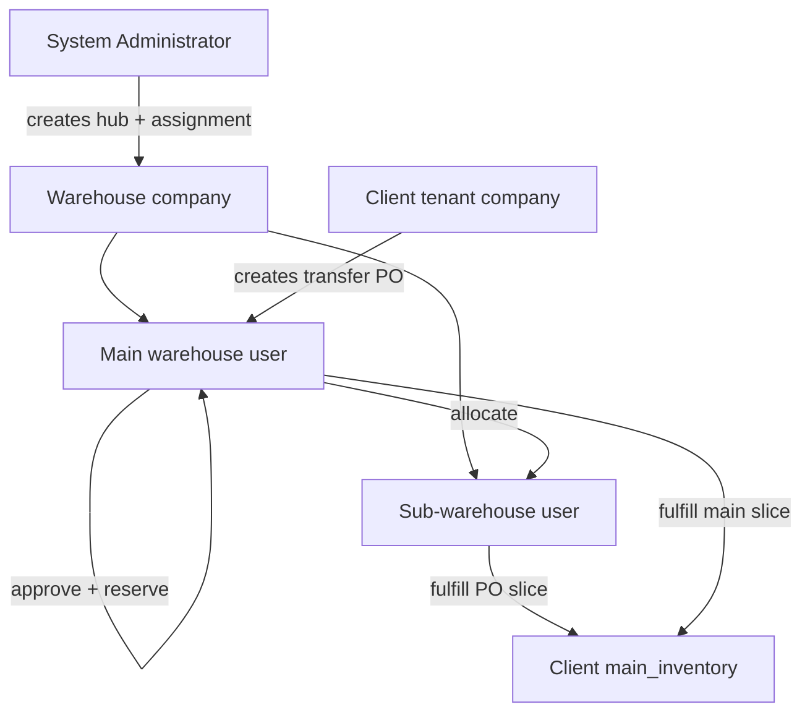
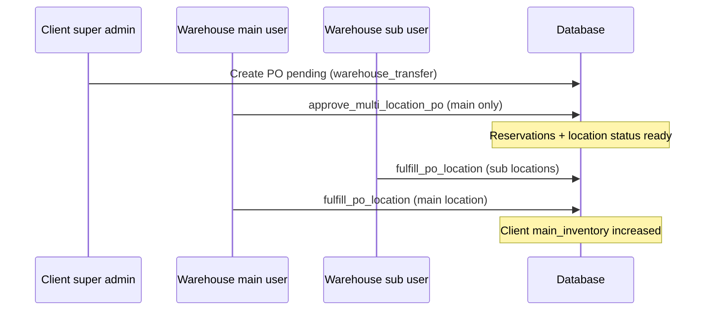

# Warehouse Role — Workflow Overview

This document describes how the **Warehouse** role (`warehouse`) works in the B1G Ordering System: hub company operations, internal stock transfers to **client tenants**, sub-warehouse structure, and catalog control.

For the **client side** of the same transfer, see [super-admin-workflow.md](./super-admin-workflow.md) (section 6.4). For field sales after stock reaches a client, see [mobile-sales-workflow.md](./mobile-sales-workflow.md) and [team-leader-workflow.md](./team-leader-workflow.md).

---

## Role identity

| Item | Detail |
|------|--------|
| Database role | `warehouse` |
| Display name | Warehouse (hub) |
| Scope | **Warehouse company** (`profiles.company_id` = hub company, not a sales tenant) |
| Typical account | User at a distribution hub linked to one or more **client companies** |

**Not the same as:**

- **`super_admin` / `admin`** — operate inside a **sales tenant**; they *request* stock via transfer POs.
- **`system_administrator`** — creates warehouse companies, assignments, and warehouse user accounts.

**Provisioning:** system administrator creates the warehouse company and user (`create-warehouse` edge function / Management Portal). **`warehouse_company_assignments`** links each warehouse user to **client companies** they fulfill (typically **one client company per assignment**).

**Location membership:** each warehouse user is linked via `warehouse_location_users` to a `warehouse_locations` row:

| Membership | Meaning |
|------------|---------|
| **Main warehouse** (`is_main = true`) | Sees hub **main inventory**; can create sub-warehouses, allocate stock, **approve** multi-location transfer POs |
| **Sub-warehouse** (`is_main = false`) | Sees only **their location’s** `warehouse_location_inventory`; can **fulfill** their slice of transfer POs and **return** stock to main |
| **Unlinked** (no row) | Treated as main for stock source (fail-safe); should be linked in production |

Hook: `useWarehouseLocationMembership.ts`.

---

## Access model

- **Login redirect:** `/inventory/board` (`RoleBasedRedirect.tsx`).
- **Routes:** explicit whitelist in `usePermissions.ts` (warehouse cannot open `/orders`, `/clients`, team menus, etc.).
- **Sidebar:** `warehouseMenuItems` in `AppSidebar.tsx` only.

**Allowed routes (typical):**

- `/inventory/board` — dashboard  
- `/purchase-orders` — internal transfer inbox  
- `/brands`, `/variant-types` — hub catalog  
- `/inventory/main`, `/inventory/sub-warehouses`  
- `/profile`

Warehouse users **cannot** create transfer POs (`Create PO` hidden when `role === 'warehouse'`). **Client tenants** (super admin/admin) create `warehouse_transfer` POs; warehouse **approves and fulfills**.

---

## Navigation (sidebar)

| Area | Route | Purpose |
|------|--------|---------|
| Dashboard | `/inventory/board` | Brand/SKU grid: available, overall, or sub-warehouse stock |
| Procurement | `/purchase-orders` | Inbound transfer POs from linked client companies |
| | `/brands` | Hub brands and variants (master catalog for linked tenants) |
| | `/variant-types` | Flavor, battery, POSM, etc. |
| Inventory | `/inventory/sub-warehouses` | Create sub-warehouses, allocate, return (role-dependent) |
| | `/inventory/main` | Main warehouse stock table, adjustments, returns history |
| Profile | `/profile` | Account settings |

**No access:** client orders, finance, sales agents, team management, war room, super admin dashboards.

---

## Organization model



**`warehouse_company_assignments`:**

- `warehouse_user_id` → warehouse profile  
- `client_company_id` → tenant that may send transfer POs  
- `warehouse_company_id` → hub company  
- Unique per client company (one hub assignment per tenant)

When a client is linked, their POs appear on the warehouse `/purchase-orders` list (`fulfillment_type = warehouse_transfer`, `warehouse_company_id` = hub).

---

## Typical operations — end to end

### 1. Inventory board (`/inventory/board`)

**Page:** `WarehouseInventoryDashboardPage.tsx`

Visual stock board by brand and variant type (pods, devices, POSM, etc.).

**View modes (main warehouse users):**

| Mode | Shows |
|------|--------|
| **Available** | `stock - allocatedStock` on main inventory |
| **Overall** | Total `stock` on main |
| **Sub** | Stock at a selected sub-warehouse location |

**Sub-warehouse users:** typically see their location stock only (not full hub views).

Use for daily stock visibility before allocating or fulfilling POs.

---

### 2. Catalog — brands and variant types

| Route | Actions |
|--------|---------|
| `/brands` | Create/edit brands and variants for the **warehouse company** |
| `/variant-types` | Manage variant categories |

This catalog is the **source of truth** for linked client tenants:

- Client super admin has `/brands` and `/variant-types` **hidden** when warehouse-linked.
- Transfer PO lines use hub SKUs; on fulfill, `warehouse_variant_mappings` maps hub variants → client variants.

Warehouse should maintain catalog **before** clients build transfer POs.

---

### 3. Main inventory (`/inventory/main`)

**Page:** `MainInventoryPage.tsx` (warehouse-specific behavior via `InventoryContext`)

**Main warehouse user:**

- View/edit stock in `main_inventory` (and allocated portions).
- Add brands/variants and **add stock** (batch qty per variant).
- Adjust quantities; audit via `inventory_transactions`.
- View return history (`return_to_main`, `warehouse_return_from_sub`).

**Sub-warehouse user:**

- Sees **only** their `warehouse_location_inventory` (not full main table).
- Can **return stock to main** from their location (`return_stock_from_sub_warehouse_to_main` RPC).
- Cannot create sub-warehouses or allocate from main (UI gated).

Stock source in `InventoryContext`: main uses `main_inventory`; sub uses `warehouse_location_inventory` at linked `location_id`.

---

### 4. Sub-warehouses (`/inventory/sub-warehouses`)

**Page:** `SubWarehousesPage.tsx`  
**Edge function:** `create-sub-warehouse` (creates location + warehouse user account)

#### Main warehouse user

| Action | How |
|--------|-----|
| **Create sub-warehouse** | Location name + dedicated user (name, email, password) |
| **Allocate stock** | RPC `allocate_stock_to_sub_warehouse` — moves available qty from **main** → `warehouse_location_inventory` |
| **Return from sub** | RPC `return_stock_from_sub_warehouse_to_main` — moves qty sub → main |
| **List locations** | All `warehouse_locations` for hub company + linked users |

Validation: allocation cannot exceed **available** main stock (`stock - allocated`).

#### Sub-warehouse user

| Action | How |
|--------|-----|
| **Return stock** | Return qty from **own** location back to main (same RPC, own `location_id`) |
| **Cannot** | Create sub-warehouses or allocate from main |

Internal hub flow:

```text
main_inventory (hub)
    --allocate_stock_to_sub_warehouse-->
warehouse_location_inventory (sub A, sub B, …)
    --return_stock_from_sub_warehouse_to_main-->
main_inventory (hub)
```

---

### 5. Purchase orders — internal transfers (critical)

**Page:** `/purchase-orders` (warehouse view)  
**Header:** “Pending internal transfers from your assigned client companies”

Warehouse does **not** use supplier POs or **Create PO**. Work is **incoming `warehouse_transfer` POs** from linked tenants.

#### End-to-end (warehouse + client)



| Step | Who | Action |
|------|-----|--------|
| 1. Request | Client **super admin/admin** | Creates transfer PO on tenant app (`linkedWarehouseCompanyId`); lines pick hub locations; status `pending` |
| 2. Approve | **Main warehouse** user | **Approve PO** on `/purchase-orders` (`canApproveOrder` — only main for transfers) |
| 2b. RPC | `approve_multi_location_po` | Validates stock per location+variant; creates `warehouse_transfer_reservations`; location → `ready`; PO → `approved_for_fulfillment` |
| 3. Fulfill | **Main or sub** warehouse user per location | **Fulfill** button when status `approved_for_fulfillment` / `partially_fulfilled` and user’s `location_id` matches line |
| 3b. RPC | `fulfill_po_location` | Deducts hub stock (main_inventory or `warehouse_location_inventory`); adds to **client** `main_inventory`; `warehouse_variant_mappings`; `inventory_transactions` (`warehouse_transfer_out` / `warehouse_transfer_in`) |
| 4. Complete | System | `partially_fulfilled` until all locations done → `fulfilled` |
| Reject | Warehouse (main, pending) | `rejectPurchaseOrder` → `rejected` (same as tenant cancel semantics) |

**Multi-location POs:** view dialog shows **per-location status** (`warehouse_transfer_location_status`). Each sub-warehouse fulfills only its rows; main warehouse fulfills main-location rows.

**Approve dialog (main):** previews **requested vs available** stock per location (main uses `main_inventory` available; subs use `warehouse_location_inventory`).

**Sub-warehouse PO list:** pending transfers may show status **“Waiting for Main”** until main approves.

**COF:** warehouse can view/print Confirmation of Order PDF for a PO (`generateCofPdf`) — same as tenant.

**After fulfillment:** client tenant sees stock in **their** `main_inventory`; they allocate to team leaders and field agents (see super-admin doc). Warehouse job for that PO is **done**.

#### Stock deduction rules (summary)

| Source location | Stock deducted from |
|-----------------|---------------------|
| Main warehouse location (`is_main`) | Hub `main_inventory` (available = stock − allocated) |
| Sub-warehouse location | `warehouse_location_inventory` at that `location_id` |

#### PO statuses (warehouse-centric)

| Status | Warehouse action |
|--------|------------------|
| `pending` | Review; main may **Approve** or **Reject** |
| `approved_for_fulfillment` | Locations **Fulfill** (per assigned user/location) |
| `partially_fulfilled` | Some locations done; others still **Fulfill** |
| `fulfilled` | Complete; client received stock |
| `rejected` | Closed |

---

## How warehouse fits the full supply chain

```text
[System Administrator]
  creates warehouse company + user + warehouse_company_assignments
        │
        ▼
[Warehouse hub]
  Catalog (/brands) ──► main_inventory ◄──► sub-warehouse locations
        │                      │
        │                      │◄── transfer PO fulfill ── client tenant
        │                      │
        └── (optional) supplier PO path N/A for warehouse role on hub UI
                                │
[Client tenant]                 │
  main_inventory ◄──────────────┘
        │
        ├── allocations → team leaders → mobile sales
        └── client orders (/orders) — separate from POs
```

---

## Permissions vs other roles

| Capability | Warehouse | Client super admin | Sub-warehouse user |
|------------|:-----------:|:------------------:|:------------------:|
| Own company | Hub | Sales tenant | Hub (one location) |
| Create transfer PO | No | Yes | No |
| Approve transfer PO | Main only | No | No |
| Fulfill transfer PO | Per location | No | Own location |
| Create sub-warehouse | Main only | No | No |
| Allocate main → sub | Main only | No | No |
| Return sub → main | Main (any loc) + sub (own) | No | Own |
| Hub catalog CRUD | Yes | Hidden if linked | Read scoped |
| Client `/orders` | No | Yes | No |

---

## Happy path checklist (warehouse hub)

1. **Provisioned** by system administrator (company, user, `warehouse_company_assignments` to clients).  
2. **Link** main warehouse user in `warehouse_location_users` (main location).  
3. **Catalog** — brands, variant types, initial stock on `/inventory/main`.  
4. **Sub-warehouses** (optional) — create locations/users; **allocate** stock from main.  
5. **Monitor** `/inventory/board` for available quantities.  
6. **Transfer POs** — when client creates PO: **approve** (main) → **fulfill** per location.  
7. **Returns** — sub-warehouses **return** unused stock to main as needed.  
8. **Ongoing** — adjust main stock, update catalog, repeat fulfill cycle.

---

## Code reference index

| Area | Primary files |
|------|----------------|
| Sidebar / routes | `AppSidebar.tsx`, `usePermissions.ts`, `RoleBasedRedirect.tsx` |
| Dashboard | `WarehouseInventoryDashboardPage.tsx` |
| Membership | `useWarehouseLocationMembership.ts` |
| Main inventory | `MainInventoryPage.tsx`, `InventoryContext.tsx` |
| Sub-warehouses | `SubWarehousesPage.tsx`, `create-sub-warehouse` edge function |
| Transfer POs | `PurchaseOrdersPage.tsx`, `PurchaseOrderContext.tsx` |
| Catalog | `BrandsPage.tsx`, `VariantTypesPage.tsx` |
| DB / RPCs | `approve_multi_location_po`, `fulfill_po_location`, `allocate_stock_to_sub_warehouse`, `return_stock_from_sub_warehouse_to_main` |
| Assignments | `warehouse_company_assignments`, `20260401120000_warehouse_accounts_and_po_transfers.sql` |

---

## Known gaps / notes

- Warehouse users only see transfer POs for **assigned** client companies (RLS + query filters).  
- **Supplier POs** are a **tenant** feature; warehouse UI is transfer-focused.  
- Unlinked warehouse users default to main behavior — fix data if a user should be sub-only.  
- Client tenant cannot approve their own transfer PO; must wait on hub.  
- Multi-location approval requires **main warehouse** login, not sub-warehouse account.
